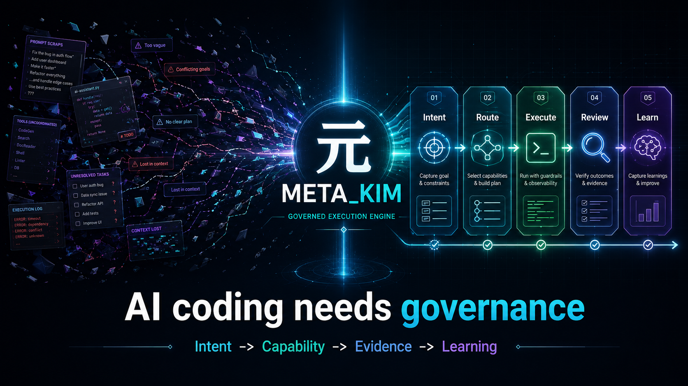
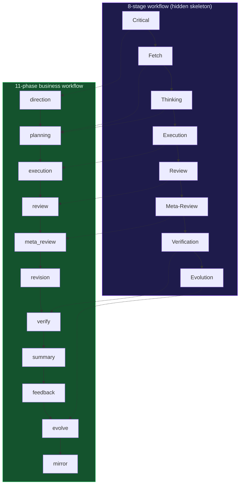
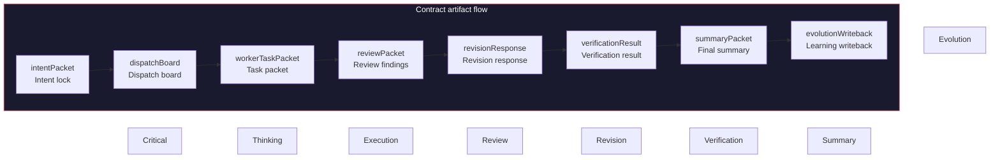
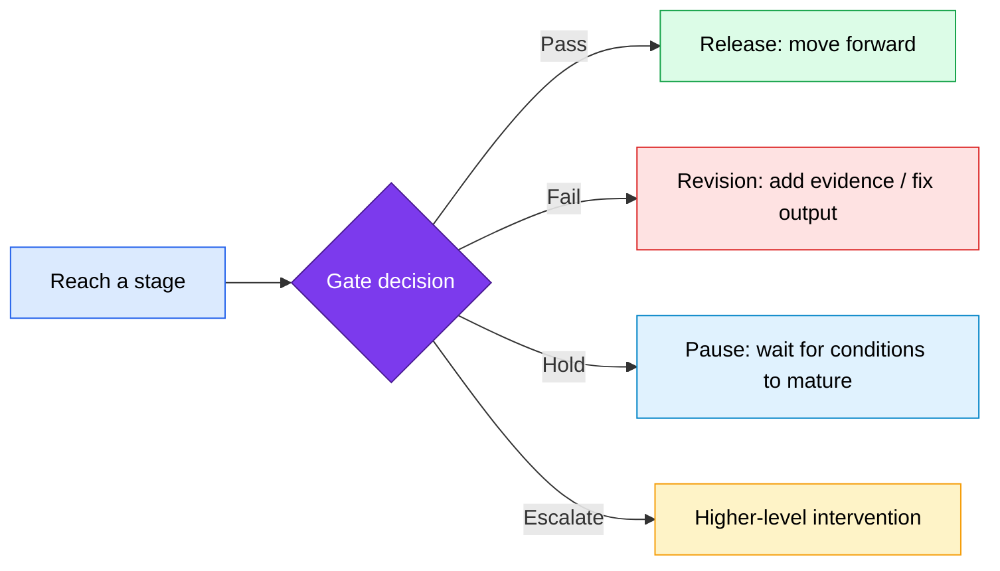
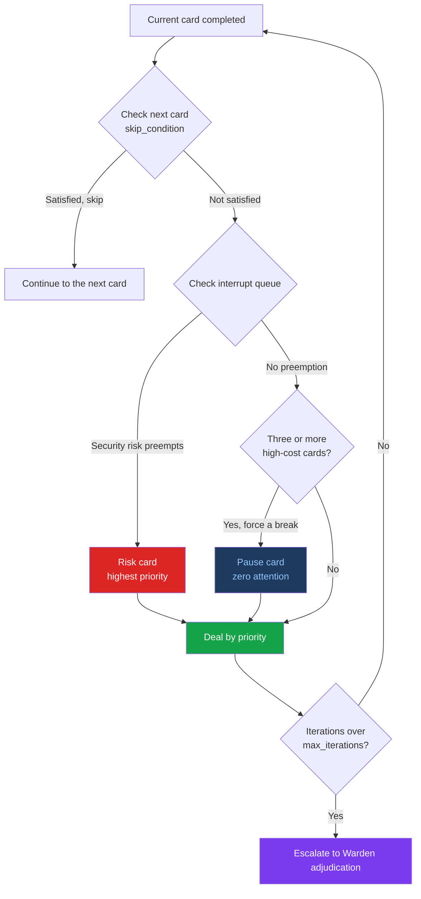
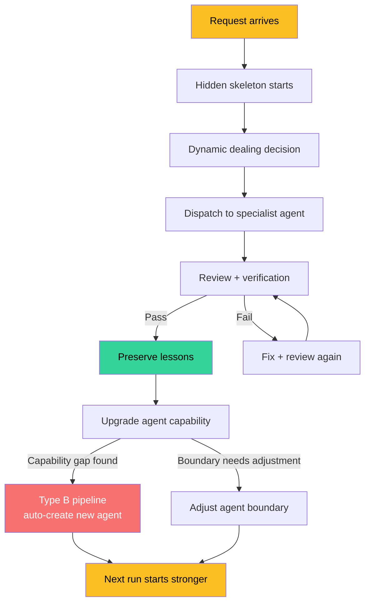
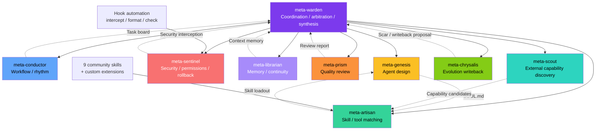
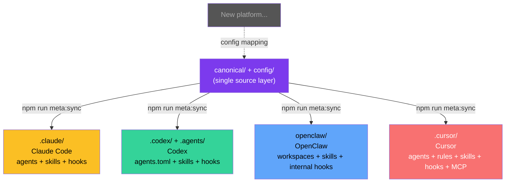
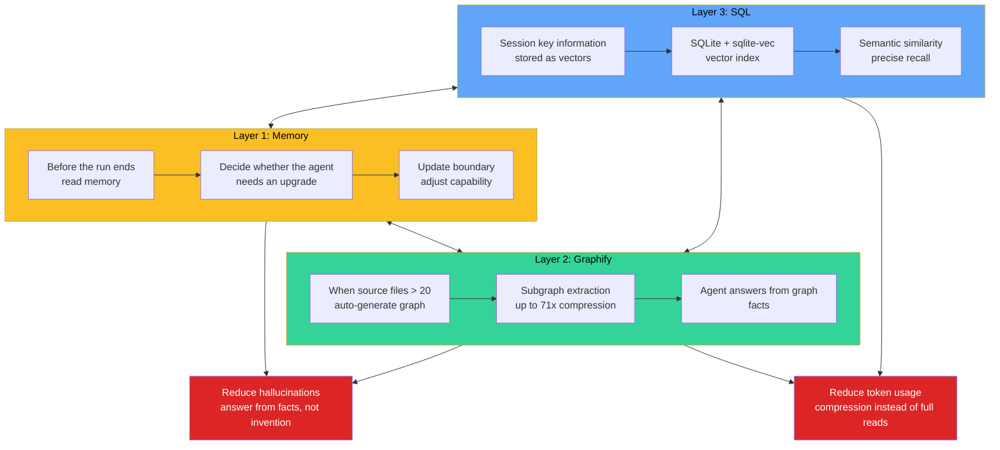

<div align="center">

<h1 style="font-size: 6em; font-weight: 900; margin-bottom: 0.2em; letter-spacing: 0.1em;">元</h1>
<p style="font-size: 1.2em; color: #7c3aed; font-weight: 600; margin-top: 0;">META_KIM</p>

<p>
  Language:
  <a href="README.md">English</a> |
  <a href="README.zh-CN.md">简体中文</a> |
  <a href="README.ja-JP.md">日本語</a> |
  <a href="README.ko-KR.md">한국어</a>
</p>

<p>
  
  
  
</p>

<p>
  
</p>

</div>

## Overview

**Meta_Kim** is not another AI coding tool. It is the governance layer for AI coding work.

The hard part of AI coding is no longer getting a model to change files. The hard part is deciding what should happen first, which capability should own it, what evidence proves it worked, and how the lesson survives the next run.

Claude Code, Codex, OpenClaw, and Cursor are all hands: they can write code and change files. But who decides which file to change first? Who reviews the result? Who fixes the problems that show up? And how do we make sure the same mistake does not repeat next time?

Meta_Kim is built for that. It is **AI above AI**: a unified governance layer that keeps complex work from turning into a mess.

### One-line summary

> **First clarify what needs to happen -> then decide who should do it -> review after execution -> preserve what was learned -> feed that back into the next run.**

This is not a new concept. Mature engineering teams already do this. Meta_Kim turns it into a runnable system instead of relying on human discipline alone.

### Before / After

| Without Meta_Kim | With Meta_Kim |
|---|---|
| One giant chat response tries to do everything | Work is routed through intent, capability, owner, review, verification, and writeback |
| A tool is chosen because it is available | A capability is selected because it fits the task, runtime, OS, dependency, and risk |
| Passing commands get mistaken for success | Evidence is checked against the user's real goal |
| Good fixes disappear into chat history | Reusable lessons become governed skills, agents, scripts, contracts, or run-scoped tasks |

### 3-minute proof

Meta_Kim is easiest to understand by watching one governed run, not by reading every rule.

```bash
npm run meta:theory:demo
npm run meta:run-status:latest
npm run meta:theory:report -- --run-id latest
npm run meta:delivery:bundle
```

The proof path shows five things:

- a fuzzy request is turned into an explicit intent and success standard
- capability search happens before execution ownership is chosen
- work is split into bounded worker tasks instead of one giant chat response
- review and verification produce artifacts, not just reassuring prose
- compatibility evidence stays tiered, so smoke evidence is never promoted to native live proof

The executable core-loop contract is `config/contracts/core-loop-contract.json`; it binds the default path to `npm run meta:theory:run -- "<task>"` and keeps Critical -> Fetch -> Thinking -> Execution -> Review -> Meta-Review -> Verification -> Evolution testable. `npm run meta:theory:demo` is the zero-argument replay entry for the 3-minute proof.

For a guided walk-through, start with [examples/first-run/README.md](examples/first-run/README.md).

## Quick Start

If you just want to try it quickly, run:

```bash
npx --yes github:KimYx0207/Meta_Kim meta-kim
```

Or install it the traditional way:

```bash
git clone https://github.com/KimYx0207/Meta_Kim.git
cd Meta_Kim
npm install
node setup.mjs
```

> 💡 **After install**: `setup.mjs` prints where every artifact lives. To revisit that summary anytime (or diff vs. the previous install), run `npm run meta:status` in the directory where you installed.

If you plan to maintain the repository, edit the canonical sources first: `canonical/agents/`, `canonical/skills/meta-theory/`, `config/contracts/`, and `config/capability-index/`. Then run (requires Node.js >= 22.13.0):

```bash
npm run meta:sync
npm run meta:validate
```

Recommended reading order:

1. This file, `README.md`
2. `AGENTS.md`
3. `CLAUDE.md` when working on Claude Code behavior
4. `canonical/runtime-assets/cursor/rules/meta-enforcement.mdc` when working on Cursor rules

### Usage Paths

After global install (`node setup.mjs` or `npx`), humans should be able to use plain task language. Slash commands remain maintainer shortcuts, not the normal user path.

| Where you are | What works automatically | Human entry path |
|---|---|---|
| Meta_Kim repo with Claude Code | Full governance via CLAUDE.md (8-stage spine, gates, dispatch rules) | Say the task naturally; durable work is classified into the governed route |
| Any other project with Claude Code | Hooks (safety, format, memory save) + meta-theory skill | Say the task naturally; explicit `/meta-theory` remains a maintainer shortcut |
| Codex | AGENTS.md rules + 9 custom agents + meta-theory command | Say the task naturally; Codex classifies durable work, subjective ambiguity, and pure queries differently |
| OpenClaw | Compatible workspace agents, skills, config, and internal lifecycle hooks | Requires OpenClaw config/auth; contributors must complete strict OpenClaw self-testing and provide evidence; changes can merge only after that evidence passes review |
| Cursor | Compatible official subagents, `.cursor/rules`, hooks, skills, and MCP mirrors | Contributors must complete strict Cursor self-testing and provide evidence; changes can merge only after that evidence passes review |

### Platform Support Tiers

Meta_Kim now tracks platform support in tiers instead of treating every compatible surface as a full runtime projection.

| Tier | Products | What it means |
|---|---|---|
| Formal tool projections | Claude Code, Codex, OpenClaw, Cursor | Canonical governance is projected into tool-specific files and checked by `npm run meta:sync` / `npm run meta:check`. |
| Native dependency install targets | opencode, Qwen, Zed, Gemini, CodeBuddy, Antigravity, JoyCode | ECC supports these through its upstream installer, but Meta_Kim does not claim a full runtime projection until profile, layout, sync, and tests exist. |
| Candidate probes | Qoder CLI, Trae, Kiro, Windsurf / Devin Desktop Cascade, Cline, Roo Code, Continue | Official docs expose compatible primitives such as rules, skills, agents/modes, hooks, MCP, commands, memory, or permission controls. Meta_Kim records them as candidate probes, not formal supported runtimes yet. |

Source of truth: `config/runtime-compatibility-catalog.json`.

Surface compatibility is intentionally weaker than runtime support. A tool can share Meta_Kim-compatible primitives and still need adapter design, profile/layout generation, sync tests, and live validation before it becomes a formal projection.

---

## Contact


GitHub <a href="https://github.com/KimYx0207">KimYx0207</a> |
X <a href="https://x.com/KimYx0207">@KimYx0207</a> |
Website <a href="https://www.aiking.dev/">aiking.dev</a> |
WeChat Official Account: <strong>老金带你玩AI</strong>

Feishu knowledge base:
<a href="https://my.feishu.cn/wiki/OhQ8wqntFihcI1kWVDlcNdpznFf">long-term updates</a>

### Buy me a coffee

If Meta_Kim has been useful, support the project with a coffee.

<table align="center">
<tr><th>WeChat Pay</th><th>Alipay</th></tr>
<tr>
<td align="center"></td>
<td align="center"></td>
</tr>
</table>

### Method basis

Meta_Kim’s methodological foundation comes from research on meta-based intent amplification, authored by this project’s maintainer (KimYx0207):

- Paper: <https://zenodo.org/records/18957649>
- DOI: `10.5281/zenodo.18957649`

---

## Architecture: Hidden Skeleton + Dynamic Dealing

This is the core design idea of Meta_Kim. If you only read one section, read this one.

### First, split the core terms so they do not get mixed up later

| Concept | What it is | What it is not |
| --- | --- | --- |
| **Hidden skeleton** | The backend framework that always exists under the visible workflow | A fixed list of responsibilities written in advance |
| **8-stage workflow** | The human-readable execution spine exposed by the hidden skeleton | The whole governance logic |
| **11-phase business workflow** | A run-packaging progression layered on top of the 8 stages after classification | A replacement for the 8 stages |
| **Dealing** | Dynamic control built around the 8-stage workflow and agent units | Simple task assignment |
| **Gate** | A pass/fail condition | The stage itself |
| **Contract** | The structured output a node must produce | Slogans or abstract values |
| **Agent-unit governance** | A practical way to manage boundaries, capabilities, upgrades, and rollback | A role menu |
| **Three-layer memory** | Long-term memory split across memory / graphify / SQL | One mixed notebook |

If you only want one sentence to remember:

> **The 8-stage workflow moves execution forward, gates decide whether a stage can pass, contracts define the required outputs, and dealing adds dynamic intervention.**

### 8 stages = the hidden skeleton

Meta_Kim has 8 fixed execution stages. This is the **hidden skeleton**:

```mermaid
flowchart LR
    C[Critical<br/>Clarify the request] --> F[Fetch<br/>Search capabilities]
    F --> T[Thinking<br/>Plan the approach]
    T --> E[Execution<br/>Dispatch the work]
    E --> R[Review<br/>Inspect the result]
    R --> MR[Meta-Review<br/>Review the review]
    MR --> V[Verification<br/>Verify reality]
    V --> EV[Evolution<br/>Write back lessons]

    style C fill:#fbbf24,color:#000
    style F fill:#34d399,color:#000
    style T fill:#60a5fa,color:#000
    style E fill:#f87171,color:#fff
    style R fill:#a78bfa,color:#fff
    style MR fill:#a78bfa,color:#fff
    style V fill:#34d399,color:#000
    style EV fill:#fbbf24,color:#000
```



**Critical - pin down the real problem first**

When the request is vague, ask clarifying questions instead of guessing. This stage produces `intentPacket`, which locks down the real user intent, success criteria, and exclusions. If the request is already clear, the system records an explicit skip reason instead of quietly skipping.

**Fetch - search existing capabilities before inventing new ones**

Search whether existing agents, skills, tools, or MCP integrations already cover the need. The core idea here is **capability-first**: define the capability first, then search for the owner that declares it, then dispatch to the best match. Capability-index lookup goes `config/capability-index/` -> runtime mirror -> local inventory -> fallback. Do not start by hardcoding a specific agent name.

**Governance Decision Engine**

Meta_Kim is not only the 8-stage spine. It first identifies the governance trigger, checks runtime and OS capability, checks dependency capability, separates owner from weapon, filters by Win/Mac/runtime support, asks the user only for branch-changing choices, executes deterministic parts, verifies whether the user goal actually landed, and writes reusable learning back. Reference-only projects are absorbed into Meta_Kim data, not silently promoted into dependencies; see `config/governance/decision-pattern-catalog.json`.

**Thinking - define boundaries, owners, sequence, deliverables, risks, and stop conditions**

Break the task into subtasks, assign owners, and make dependencies and parallel groups explicit. This stage produces a `dispatchBoard`: who does what, what can run in parallel, and who is responsible for merging the result. At least two solution paths should be explored; do not lock into a single route too early.

**Execution - produce the actual work while still under governance**

Dispatch the subtasks to specialist agents. Each subtask is wrapped in a `workerTaskPacket`, including file context, constraints, review owner, and verification owner. Independent subtasks should run in parallel when possible. **Execution is not completion** - the output still has to pass review and verification.

**Review - check quality and boundary compliance**

Inspect code quality, security, architecture compliance, and boundary violations. Produce a structured `reviewPacket` with findings. Each finding has a severity from CRITICAL to LOW. This is not a formality - unresolved findings cannot move forward.

**Meta-Review - inspect whether the review standard itself is biased or too loose**

Review the review. If the review standard is too weak, the system is not really reviewing. If it is biased, it is reviewing the wrong thing. This stage protects the quality of the review system itself.

**Verification - confirm that reality matches the claim**

Verify whether the fixes really closed the review findings. This stage produces `verificationResult` and `closeFindings`. If the fix did not actually close the finding, go back and repair it before verifying again. This is the most honest gate in the system.

**Evolution - write capability gaps and reusable patterns back into the system**

Convert experience into structural upgrades: reusable patterns go into memory, failures become learning artifacts, capability gaps are handed to Scout, and agent boundaries are written back into canonical sources. Every run must end with a `writebackDecision`: either write back something concrete or explicitly explain why there is nothing to persist. **A run that does not preserve learning is wasted work.**

---

The 8 stages together form the execution spine.

Why are they only "relatively" fixed? Because some stages can be skipped in simple cases - but the system must explicitly record why they were skipped. Nothing is skipped silently.

### 11 phases = a business workflow built on the skeleton

If the 8-stage workflow is the skeleton, then the 11-phase business workflow is the **run-packaging progression** that grows on top of it:

```text
direction -> planning -> execution -> review -> meta_review -> revision -> verify -> summary -> feedback -> evolve -> mirror
```

It is not a second system. It is derived from the 8-stage skeleton. The difference is:

- **The 8 stages** focus on execution logic - "what order should work happen in"
- **The 11 phases** focus on business governance - "what each phase must deliver, how completion is defined, and when mirrors must be refreshed"



The 11-phase business workflow adds `revision`, `summary`, `feedback`, and `mirror`, so the process is not only about "getting it done" but also about getting it done well, closing the loop correctly, and keeping runtime projections aligned.

### Contracts = what each node must deliver

Workflow alone is not enough. Each stage also needs to define **what it must output**. That is what the contracts do.

Meta_Kim contracts are not verbal agreements. They are **structured packets**:

| Contract artifact | Stage | Purpose |
| --- | --- | --- |
| `coreLoop` | All stages | Compact evidence that the default governed path followed the eight-stage contract |
| `intentPacket` | Critical | Lock the real intent and prevent drift |
| `dispatchBoard` | Thinking | Define owners, dependencies, and parallel groups |
| `workerTaskPacket` | Execution | Carry the full context for each subtask |
| `reviewPacket` | Review | Record structured findings |
| `revisionResponse` | Revision | Respond to each review finding |
| `verificationResult` | Verification | Confirm whether the issue was actually closed |
| `summaryPacket` | Summary | Final summary before public release |
| `evolutionWriteback` | Evolution | Define what should be written back |



These artifacts are not optional documents. They are the system’s source of truth. Without contracts, the next node is not "handing off" - it is guessing what the previous node meant. That is why so much AI collaboration falls apart on complex work.

The current implementation carries these artifacts explicitly: `taskClassification` before execution, `cardPlanPacket` before dealing, `dispatchEnvelopePacket` before dispatch, `reviewPacket.findings` after review, `revisionResponses` + `verificationResults` + `closeFindings` between revision and verification, `summaryPacket` before external publication, and `writebackDecision` before evolution.

`npm run meta:validate:run` checks whether these artifact chains close completely.

### Gates = stage reached does not mean stage passed

Contracts define what each node must deliver. Gates define whether that delivery is good enough to move forward.

In one sentence:

> **A stage tells you where you are; a gate tells you whether you are allowed to move on.**



Key gates in the system:

| Gate | What it blocks | Pass condition |
| --- | --- | --- |
| **planning gate** | Moving from planning into execution | Boundaries, owners, deliverables, and risks are defined |
| **metaReview gate** | Whether meta-review is strong enough | The review standard itself is not biased, missing, or too loose |
| **verify gate** | Whether the fix really closed the issue | `finding -> revision -> verification` closes cleanly |
| **summary gate** | Whether the result can be published | Verification passed + summary completed |
| **publicDisplay gate** | Whether the system can claim "done" | `verifyPassed + summaryClosed + singleDeliverableMaintained + deliverableChainClosed` |

The most important one is the **publicDisplay gate**. If verification has not passed, the summary is not closed, or the deliverable chain is broken, the system cannot pretend that the work is finished.

The relationship between gates and contracts:

- **Contracts** answer "what must this node deliver" - they are about delivery obligations
- **Gates** answer "is this good enough to move forward" - they are about release decisions
- Without contracts, gates have nothing to judge
- Without gates, contracts are just a ceremony

### Dynamic dealing = flexibility layered on top of the skeleton

The 8-stage skeleton is relatively fixed, but real tasks vary too much to be handled by one rigid path. That is why Meta_Kim introduces **dynamic dealing**.

Dealing corresponds to the 8 stages, but not as a simple 1:1 map. The 10 cards are:

| Card | Trigger condition | Attention cost |
| --- | --- | --- |
| **Clarify** | The request is vague | Low |
| **Shrink scope** | The repository is too large or has too many files | Low |
| **Options** | The request is clear but there are many possible paths | Medium |
| **Execute** | The plan is decided | High |
| **Verify** | Execution is complete | Medium |
| **Fix** | Verification failed | Medium |
| **Rollback** | Risk is spreading | High |
| **Risk** | Security, global, or multi-party impact is involved | High |
| **Nudge** | The user is stuck and needs a light push | Low |
| **Pause** | Three high-cost cards have been used in a row | Zero |

The important part is that some cards are dynamic:

- When three high-attention cards are dealt consecutively, the system forcibly inserts **Pause** - it does not wait for the user to notice
- When security risk appears, **Risk** preempts the current flow
- When the user already knows something, the corresponding card is skipped
- When task iteration exceeds the upper bound, the system escalates to **Warden adjudication**

Dynamic dealing gives the fixed skeleton some breathing room: strict where it must be strict, flexible where flexibility helps.



### Closed loop = iterate, generate, improve

Once the skeleton, progression workflow, contracts, and dynamic dealing are in place, the system forms a **closed loop**:

```text
Request arrives -> skeleton starts -> dealing decision -> dispatch execution -> review and verify -> preserve lessons -> upgrade agents -> next run starts stronger
```

The loop is not one-and-done. Each round can:

1. **Generate the missing agent** - if a capability gap appears, the system can create a new agent through the Type B pipeline
2. **Improve agent capability** - Evolution writes back changes to SOUL.md, skill loadouts, and toolchains
3. **Clarify every agent’s boundary** - each agent owns one class of work; boundary violations are intercepted by Sentinel



### Agent boundaries + skill integration

The 9 meta roles each own a different domain:

| Role | Responsibility | What it does not own |
| --- | --- | --- |
| **meta-warden** | Coordination, arbitration, final synthesis | Does not directly write code |
| **meta-conductor** | Workflow and rhythm control | Does not do security review |
| **meta-genesis** | Agent design and SOUL.md | Does not choose tools |
| **meta-artisan** | Skill, MCP, and tool matching | Does not define persona |
| **meta-sentinel** | Security, permissions, rollback | Does not choreograph rhythm |
| **meta-librarian** | Memory and continuity | Does not execute code |
| **meta-prism** | Quality review and anti-slop | Does not search for capabilities |
| **meta-scout** | External capability discovery | Does not coordinate internally |
| **meta-chrysalis** | Evolution writeback, scar capture, recursive-safety gatekeeping | Does not evolve itself or bypass Warden gates |

Each agent can load powerful **skills** and **commands** as needed. Meta_Kim ships with 9 community skills and supports custom extension.



### Hook automation

In Claude Code, Meta_Kim uses **hooks** for automation:

- **Dangerous command blocking**: operations like `rm -rf` and `DROP TABLE` are blocked automatically
- **Git push reminder**: remind you to check before pushing
- **Formatting**: automatically format JS/TS files after edits
- **Type checking**: run TypeScript checks after edits
- **console.log warning**: remind you to remove `console.log`
- **Session-end audit**: check for leftover issues before the session ends
- **Session-end memory save**: write session summaries to MCP Memory Service on session end
- **Subagent context injection**: automatically inject project context into subagents

These hooks are not optional polish. They are the execution-layer guardrails of the governance system.

### Cross-platform mapping

**The whole architecture can be mapped onto any project that supports agents and agent-to-agent communication.**

Meta_Kim currently maps to four tool targets:

| Platform | Status | Mapping style |
| --- | --- | --- |
| **Claude Code** | Fully supported | `.claude/agents/*.md` + `SKILL.md` + hooks + MCP |
| **Codex** | Fully supported | `.codex/agents/*.toml` + `.agents/skills/` + commands + hooks |
| **OpenClaw** | Compatible formal projection | `openclaw/` workspaces + skills + internal hooks; stricter tool-denial changes need contributor-owned OpenClaw self-test evidence, and can merge only after that evidence passes review |
| **Cursor** | Compatible formal projection | `.cursor/agents/*.md` + `.cursor/rules/*.mdc` + skills + hooks + MCP; Cursor changes need contributor-owned Cursor self-test evidence, and can merge only after that evidence passes review |

The canonical source layer is `canonical/agents/`, `canonical/skills/meta-theory/`, `config/contracts/`, and `config/capability-index/`. The repository mirrors that layer into platform-specific projections through `npm run meta:sync`.



You can keep adding platform mappings over time as long as the platform supports agents and agent communication.

The four tool targets are first-class Meta_Kim projections, but their native surfaces differ. Claude Code and Codex are both fully supported. OpenClaw and Cursor are compatible formal projections; PRs that improve either target must include strict contributor-owned self-test evidence from that tool, and can merge only after that evidence passes review.

| Capability surface | Claude Code | Codex | OpenClaw | Cursor |
| --- | --- | --- | --- | --- |
| **Agents** | Native agents/subagents, mature at both project and user scope | Strong custom agents/subagents | Workspace-style agents, supports agent-to-agent | Official subagents under `.cursor/agents` with project-rule compatible governance context |
| **Skills / references** | Native skills, references, and a mature global ecosystem | `.agents/skills/` is the project skill root | Workspace skills and installable skills | Project skill/reference mirrors |
| **Hooks / automation** | Project hooks + settings.json + plugin ecosystem | Trusted `.codex/hooks.json` project/user hooks | Internal lifecycle hooks; typed plugin hooks needed for blocking/canceling policy | `.cursor/hooks.json` lowerCamel lifecycle hooks with `preToolUse` / `failClosed` |
| **MCP / configuration** | Full native MCP and config surface | Can connect via runtime adapters and MCP | Clear workspace config | Project MCP and configuration mirrors |
| **Governance loop support** | Fully supported through Claude-native surfaces | Fully supported through Codex-native surfaces | Compatible through OpenClaw-native surfaces; typed plugin tool-denial changes need strict tests | Compatible through Cursor-native surfaces; project decision cards and official hook gates preserve compatibility semantics |

The point is compatibility discipline, not a ranking: each formal tool target keeps its own agent, skill, hook, MCP, choice, and config surface instead of pretending one host's format is universal.

Choice surfaces are tool-specific. Claude Code should use `AskUserQuestion`; Codex should use `request_user_input` when `~/.codex/config.toml` has `[features].default_mode_request_user_input = true`; Cursor uses an `alwaysApply` project rule to trigger a chat decision card plus official `preToolUse` / `failClosed` hooks for tool gating; OpenClaw uses workspace/chat cards unless a typed plugin approval hook is explicitly installed and strictly tested.

### Four-layer repository structure

| Layer | Location | Purpose |
| --- | --- | --- |
| **Canonical source** | `canonical/agents/`, `canonical/skills/meta-theory/`, `config/contracts/`, `config/capability-index/` | Preferred place for long-term edits |
| **Tool projections** | `.claude/`, `.codex/`, `openclaw/`, `.cursor/` | Mirrors of the same capabilities for different tool targets |
| **Local state** | `.meta-kim/state/{profile}/`, `.meta-kim/local.overrides.json` | Profile-level state, run index, continuity |
| **Scripts and checks** | `scripts/`, `npm run *` | Sync, validate, discover, and accept |

### Three state layers (project / global / local)

These three layers are easy to mix up, so they must stay separate:

| Layer | Storage location | What it decides |
| --- | --- | --- |
| **Project-level** | Current repository `canonical/`, `config/contracts/`, `config/capability-index/`, runtime projections, docs, scripts | What this project itself defines |
| **Global-level** | `~/.claude/`, `~/.codex/`, `~/.openclaw/`, `~/.cursor/`, `~/.meta-kim/global/` | What can still be discovered on this machine |
| **Local-level** | `.meta-kim/state/{profile}/run-index.sqlite`, `compaction/`, `profile.json` | What a run left behind for this profile |

#### What lives inside `.meta-kim/`?

`.meta-kim/` is Meta_Kim's local save file. It does three things:

**1. Remembers your choices** — `local.overrides.json`

When you run `node setup.mjs` for the first time and pick "I want Claude Code and Codex", that choice is saved here. Next time you run setup, you don't have to choose again.

*Example: You have Claude Code, Codex, and OpenClaw installed, but only want the first two. This file stores that preference — all scripts read it to know which runtimes to install skills for.*

**2. Records work history** — `state/{profile}/run-index.sqlite`

When you run a governed workflow (e.g. "use the 8-stage spine to review some code"), the result can be indexed into a SQLite database. Later you can query "what did I review last time, what was found, what's still unresolved?"

*Example: Last week you asked meta-prism to review the auth module. This week you changed the auth module again. The system checks `.meta-kim/state/` and finds "last review found 3 issues, 2 were fixed, 1 is still open" — you don't have to repeat yourself.*

**3. Cross-session recovery** — `state/{profile}/compaction/`

When you're halfway through a conversation and your token budget runs out, the compaction packet saves your current progress (which step you're on, what's still pending) so you can pick up where you left off in a new session.

*Example: You ask Meta_Kim to do a complex multi-file refactor. You get through step 6 before the session ends. Next session, the system reads the compaction packet: "at step 6, step 7 hasn't started" — picks up from step 7, no need to start over.*

**Other files:** `doctor-cache/` stores `npm run meta:doctor:governance` results (written after each run), `migrations/` tracks schema upgrades between Meta_Kim versions, `profile.json` stores profile metadata. All managed by scripts — you never edit them by hand.

**Quick reference:**

| Path | What it does | When written |
| --- | --- | --- |
| `local.overrides.json` | Remembers your runtime selection from `setup.mjs` | Auto — first `setup.mjs` run |
| `state/{profile}/profile.json` | Profile metadata (creation time, name) | Auto — `setup.mjs` creates the `default` profile |
| `state/{profile}/run-index.sqlite` | Indexed governed run records — who ran what, what was found, what's still open | On demand — `npm run meta:index:runs -- <artifact>` |
| `state/{profile}/compaction/` | Cross-session handoff packets: unfinished steps, pending findings, open verification gates | On demand — governed run that needs to survive a session break |
| `state/{profile}/doctor-cache/` | Cached results from `npm run meta:doctor:governance` | On demand — `doctor:governance` writes here |
| `state/{profile}/migrations/` | State migration tracking (schema upgrades between versions) | Auto — when state schema changes between versions |

### What works globally vs. in-repo only

Meta_Kim's gates and protocols work on three enforcement layers. After global installation (`node setup.mjs`), here is what works in any project versus what requires the Meta_Kim repo:

| Enforcement layer | Global install | Needs Meta_Kim repo |
| --- | --- | --- |
| **Prompt layer** (agents + skills enforce gates/protocols) | Works — installed to `~/.claude/skills/` and `~/.claude/agents/` | — |
| **Hook layer** (session-end gate checks, memory save to MCP Memory Service, dangerous command blocking) | Works — configured in `.claude/settings.json` | — |
| **Config layer** (contract definitions are referenced in skill prompts) | Works — AI reads the rules from the installed skill | — |
| **Code validation** (`npm run meta:validate:run` hard-checks packet chains) | — | Required — script lives in `scripts/validate-run-artifact.mjs` |

The first three layers are the primary defense and work everywhere. Code validation is a final safety net that requires running from the Meta_Kim repo (or pointing to its scripts).

---

## Three-Layer Memory

Meta_Kim does not use a single memory layer. It uses three, each with a different job, so agents can keep improving while becoming more familiar with the project.

Each layer has different activation requirements:
- **Layer 1** is built into Claude Code — requires Claude Code runtime (auto-memory at `~/.claude/projects/*/memory/`)
- **Layer 2** is installed automatically by `node setup.mjs`
- **Layer 3** is installed by `node setup.mjs` but requires manual server startup (see Layer 3 activation below)

### Layer 1: Memory (agent upgrade memory)

- **Responsibility**: agent upgrades and continuous learning
- **Storage**: `.claude/projects/*/memory/`
- **Mechanism**: before each run ends, the system reads memory and uses it to decide whether the agent should be upgraded or its boundary should change
- **Core value**: agents get smarter over time instead of restarting from zero each time
- **Activation**: automatic — AI reads and writes memory during each session
- **Query**: ask AI directly — "what did we learn from previous sessions about this project?"

### Layer 2: Graphify (project-level LLM wiki)

- **Responsibility**: project-level code knowledge graph
- **Storage**: `graphify-out/graph.json` (NetworkX node-link format); for humans and agents, prefer `graphify-out/GRAPH_REPORT.md` when present
- **Mechanism (data)**: `node setup.mjs` (optional Python step) installs graphify and **idempotently** runs `python -m graphify claude install` and `python -m graphify hook install` even if graphify was already installed via pip; git hooks rebuild the graph on commit/checkout in the **current repo**. `npm run meta:graphify:install` does the same (including hooks).
- **Mechanism (usage)**: synced meta-theory `dev-governance.md` Fetch **Step 0.5** defines how the model should detect and use the graph — not a background service. Claude Code subagents get a **short hint** via `subagent-context.mjs`, not automatic embedding of `graph.json`. Codex / OpenClaw / Cursor share the same reference after `meta:sync` but have no SubagentStart hook; optional `python -m graphify codex install` or `python -m graphify claw install` in a **target repo** patches that repo’s docs per graphify CLI (`python -m graphify --help`).
- **Core value**:
  - Make memory increasingly familiar with the project - not by remembering raw code, but by understanding structure and relationships
  - **Reduce hallucinations** - agents answer from graph facts instead of guessing
  - **Cut token usage** - subgraph extraction replaces raw file reads, with up to 71x compression
- **Quality threshold**:
  - Fuzzy nodes > 30% -> mark the graph as low quality and fall back to direct file reads
  - Total nodes < 10 -> the graph is too sparse and should fall back to Glob/Grep
  - A "god node" with too many incoming edges -> mark as a serial bottleneck
- **Activation**: `node setup.mjs` optional Python step or `npm run meta:graphify:install` — install/check, networkx, Claude-side registration, **this repo’s** git hooks; first graph build still depends on a hook run or a manual build command
- **Query**: `python -m graphify query "your question"` — natural language query against the code graph

### Platform Automation Comparison

| Capability | Claude Code | Codex | OpenClaw | Cursor |
|-----------|------------|-------|----------|--------|
| PreToolUse hook (auto-prompt before Glob/Grep) | ✅ settings.json | ✅ trusted `.codex/hooks.json` | ❌ | ✅ `.cursor/hooks.json` `preToolUse` |
| Slash command `/graphify` | ✅ | ✅ | ✅ | ✅ |
| git hook auto-rebuild (post-commit/checkout) | ✅ | ✅ | ✅ | ✅ |
| AGENTS.md resident rules | N/A | ✅ | ✅ | ✅ |
| Multi-platform install via setup.mjs | ✅ claude | ✅ codex | ✅ claw | ✅ cursor |

**Key insight**: Claude Code, Codex, and Cursor all have native hook configuration, but their schemas differ. OpenClaw uses its own internal/plugin hook model.

For multi-platform setups, run `node setup.mjs` — it loops through all selected platforms and runs `graphify <platform> install` for each one idempotently.

### Layer 3: SQL (vector-level session retrieval)

- **Responsibility**: vector storage and retrieval for project sessions
- **Storage**: SQLite + vector extension (`sqlite-vec`)
- **Mechanism**: store key session information as vectors, then retrieve later by semantic similarity
- **Core value**:
  - Cross-session continuity - pick up where the last conversation left off
  - Vector-level retrieval - semantic understanding instead of keyword matching
  - Precise recall - find the most relevant context from historical sessions
- **Activation**: `node setup.mjs` installs and configures the MCP Memory Service (Layer 3), installs runtime memory hooks, then attempts to start the HTTP service in the background.
  - For **Claude Code**: SessionStart and Stop memory-save hooks are auto-registered during `node setup.mjs`; session-start writes project state via `mcp_memory_global.py --mode session`.
  - For **Codex**: `~/.codex/hooks.json` receives SessionStart, UserPromptSubmit, and Stop bridges to `meta-kim-memory-save.mjs`, so start/prompt/end checkpoints are automatic.
  - For **OpenClaw**: `~/.openclaw/hooks/mcp-memory-service` receives a managed hook for `command:new`, `command:reset`, `session:compact:after`, and `command:stop`.
  - For **Cursor**: `~/.cursor/hooks.json` receives `beforeSubmitPrompt` and `stop` bridges to the shared memory hook.
- **Start server**: `memory server --http` (with `MCP_ALLOW_ANONYMOUS_ACCESS=true` on macOS/Linux, or `$env:MCP_ALLOW_ANONYMOUS_ACCESS="true"` in Windows PowerShell), then access at `http://localhost:8000`.
- **Port**: the server and Meta_Kim hooks use `http://localhost:8000`.
- **Hooks**: auto-registered for Claude Code, Codex, Cursor, and OpenClaw; each runtime uses its native hook format while sharing the same MCP Memory HTTP endpoint.
- **MCP registration vs writes**: `.mcp.json` registers the MCP Memory server (`memory server`) for client access. Automatic session writes are separate lifecycle hooks: Claude Code uses `stop-memory-save.mjs`, Codex/Cursor use `meta-kim-memory-save.mjs`, and OpenClaw uses its managed `mcp-memory-service` hook.
- **Query**: `npm run meta:query:runs -- --owner <agent>` — find past runs by agent, or `npm run meta:index:runs -- <artifact>` for manual indexing of validated run artifacts
- **Troubleshooting**:
  - **Python hook fails on Windows**: If the SessionStart hook fails with exit code 49 or shows no output, the Python command may point to the Windows Store shim. Run `node scripts/install-mcp-memory-hooks.mjs` to auto-detect and fix. The installer now skips WindowsApps shims and prefers explicit Python executables from `LOCALAPPDATA\Programs\Python*`. Use `--force` flag to re-register even if current path appears valid.
  - **Check installation**: Run `node scripts/install-mcp-memory-hooks.mjs --check` to verify hook status and Python path validity.
  - **Manual verification**: Test your Python command with `python --version` or the detected path with `"C:/Users/YOUR_USER/AppData/Local/Programs/Python/Python311/python.exe" --version`.

### How the three layers work together



The three memory layers work together toward two core goals:

1. **Greatly reduce hallucinations** - agents answer from facts and context instead of inventing details
2. **Greatly reduce token usage** - use graph compression instead of full-file reads and vector retrieval instead of brute-force search

---

## Ops Command Quick Reference

### Daily use

| Command | Purpose |
| --- | --- |
| `node setup.mjs` | Interactive install / update / check wizard |
| `git pull --ff-only` | For clone installs, pull the latest Meta_Kim source from GitHub |
| `node setup.mjs --update` | Refresh the current installation projections, skills, and dependencies; it does not pull Meta_Kim source code |
| `node setup.mjs --update --project-dir <dir> --project-dir <dir>` | Refresh project-level runtime files in explicit project directories |
| `node setup.mjs --update --all-projects` | Refresh project-level runtime files in saved project directories |
| `node setup.mjs --check` | Environment check without writing |
| `node setup.mjs --lang zh-CN` | Force the Chinese UI |

Project directory updates only touch directories you select, pass with
`--project-dir`, or save for reuse. Add `--save-project-dirs` with
`--project-dir` to remember a script-provided list for later `--all-projects`
runs. Existing local `settings`, MCP, and hook configuration files are merged
or preserved instead of being blindly replaced.

Interactive update flow:

1. Run `node setup.mjs --update`.
2. If you already saved project directories, choose "Update all saved project
   directories".
3. To configure them for the first time, choose "Add or change saved project
   directories, then update them".
4. Enter the directories in one line, separated by semicolons or commas:
   `D:/Project/a; D:/Project/b; D:/Project/c`.
5. Remembered directories are stored in `.meta-kim/local.overrides.json` under
   this Meta_Kim checkout as `projectDeployDirs`; later runs can use
   `node setup.mjs --update --all-projects`.

### Sync and validation

| Command | Purpose |
| --- | --- |
| `npm run meta:sync` | Sync from canonical sources to all four runtimes |
| `npm run meta:check:runtimes` | Check whether the four runtimes are in sync |
| `npm run meta:validate` | Validate repository integrity |
| `npm run meta:verify:all` | Full validation, including runtime smoke checks |
| `npm run meta:doctor:governance` | Governance health check |

### Where the active rules live

| Surface | Current source |
| --- | --- |
| Repository / Codex rules | `AGENTS.md` |
| Claude Code rules | `CLAUDE.md` |
| Meta-theory skill | `canonical/skills/meta-theory/SKILL.md` |
| Meta-theory details | `canonical/skills/meta-theory/references/` |
| Cursor declarative backup rule | `canonical/runtime-assets/cursor/rules/meta-enforcement.mdc` |
| Cursor choice-surface fallback rule | `canonical/runtime-assets/cursor/rules/meta-choice-surface.mdc` |
| Runtime mirrors | `.claude/`, `.codex/`, `.cursor/`, `openclaw/` after `npm run meta:sync` |

When in doubt, edit canonical sources first, then run `npm run meta:sync` and `npm run meta:check`.

### How to tell which scripts are useful

Start with `package.json` scripts. The supported maintenance paths are the `meta:*` commands documented above; most helper files under `scripts/` exist because those commands call them. Use `npm run meta:status`, `npm run meta:check`, and `npm run meta:verify:all` for normal operation. Inspect an individual helper only when a `package.json` script or test points to it.

### Skills and dependencies

| Command | Purpose |
| --- | --- |
| `npm run meta:deps:install` | Install the 9 community skills globally for the default Claude Code + Codex path |
| `npm run meta:deps:install:all-runtimes` | Explicitly install them into Claude Code, Codex, OpenClaw, and Cursor |
| `npm run meta:deps:install:claude-plugins` | Install Claude Code marketplace plugins only |
| `npm run discover:global` | Scan global capabilities |
| `npm run meta:sync:global` | Sync meta-theory to the user-level runtime |

`planning-with-files` is a core external dependency, not a project-local `.agents/skills/` mirror. After dependency install, check runtime home directories such as `~/.codex/skills/planning-with-files/`, `~/.claude/skills/planning-with-files/`, `~/.cursor/skills/planning-with-files/`, or `~/.openclaw/skills/planning-with-files/`. Do not conclude it is missing from the absence of `.agents/skills/planning-with-files/` alone.

#### Native dependency installs (Superpowers, ECC, cli-anything)

Superpowers has native plugin entry points in Claude Code, Codex, and Cursor. Meta_Kim no longer treats the old Codex / Cursor `skills/superpowers` fallback as a correct plugin install; update runs remove the legacy fallback written by older Meta_Kim versions and tell users to use the host-native plugin entry point.

ECC uses the upstream `affaan-m/ECC` package and plugin identity. Claude Code installs through `ecc@ecc`; home-based targets such as Codex, opencode, and Qwen use ECC's own CLI installer with the `core` profile. Project-local ECC targets such as Cursor, Zed, Gemini, CodeBuddy, Antigravity, and JoyCode must be installed from each project root with the upstream ECC command, so Meta_Kim cleans old fallback directories and prints the exact command instead of installing into the wrong global or npm-cache directory.

For plugin bundles without a native host plugin entry point, the installer still falls back to a sparse-checkout of the upstream bundle's runtime-specific subtree:

| Runtime | Preferred subdir chain |
| --- | --- |
| Claude Code | native `claude plugin install <spec>@<marketplace>` (skills without `claudePlugin` fall back to `skills/`) |
| Codex | Superpowers uses the Codex Plugins pane or `/plugins`; ECC uses `npx --yes --package ecc-universal@latest ecc install --profile core --target codex` and currently installs the `refactor-cleaner` agent, not the `/refactor-clean` slash command because upstream ECC does not expose `commands-core` for Codex; other bundles fall back through `.codex/` → `.codex-plugin/` → `skills/` |
| Cursor | Superpowers uses `/add-plugin superpowers` or Cursor's plugin marketplace; ECC is project-local: run `npx --yes --package ecc-universal@latest ecc install --profile core --target cursor` from the project root; other bundles fall back through `.cursor/` → `.cursor-plugin/` → `skills/` |
| OpenClaw | `skills/` |
| opencode | ECC uses `npx --yes --package ecc-universal@latest ecc install --profile core --target opencode`; other bundles fall back through `.opencode/` -> `skills/` |
| Qwen | ECC uses `npx --yes --package ecc-universal@latest ecc install --profile core --target qwen` |
| Zed, Gemini, CodeBuddy, Antigravity, JoyCode | ECC is project-local: run `npx --yes --package ecc-universal@latest ecc install --profile core --target <target>` from each project root |
| Qoder CLI | Candidate probe only: generic bundle probing can look for `.qoder/` -> `skills/`, but ECC is not run for Qoder because upstream `ecc install --help` does not list `qoder` |
| Trae, Kiro, Windsurf / Devin Desktop Cascade, Cline, Roo Code, Continue | Candidate probes only: compatible primitives are tracked in `config/runtime-compatibility-catalog.json`, but Meta_Kim does not install or project to them until an adapter, sync path, and validation suite exist |

Sparse-checkout fallback trees land in `~/.<runtime>/skills/<id>/`; native ECC installs do not. The default install/update path selects Claude Code + Codex when the user presses Enter; run `npm run meta:deps:install:claude-plugins` for the Claude marketplace path only, or `npm run meta:deps:install:all-runtimes` to cover Claude Code, Codex, OpenClaw, and Cursor explicitly. Upgrading from an older install? Legacy full-repo clones are auto-detected by the `.claude-plugin/` marker at the target root and re-extracted on the next run; old Codex/Cursor `skills/superpowers`, `skills/ecc`, and `skills/everything-claude-code` fallbacks are removed or replaced with native-install instructions.

### Advanced ops

| Command | Purpose |
| --- | --- |
| `npm run meta:validate:run -- <file.json>` | Validate governed run artifacts |
| `npm run meta:eval:agents` | Lightweight runtime smoke test |
| `npm run meta:eval:agents:live` | Live prompt-backed acceptance |
| `npm run meta:probe:clis` | Probe local CLI tools |
| `npm run meta:test:mcp` | MCP self-test |
| `npm run meta:index:runs -- <dir>` | Index validated run artifacts |
| `npm run meta:query:runs -- --owner <agent>` | Query the run index |
| `npm run migrate:meta-kim -- <dir> --apply` | Import an older prompt pack |

---

## FAQ

### Q: I installed via `npx`, where are my files?

Meta_Kim writes to 3 places:

1. **Current directory** — `.claude/`, `.codex/`, `.cursor/`, `openclaw/` runtime projections for THIS project
2. **Your home** — `~/.claude/skills/meta-theory/` (plus `.codex / .cursor / .openclaw`) for global skills shared across all projects
3. **Manifest** — `~/.meta-kim/install-manifest.json` tracks everything for safe rollback

Run `npm run meta:status` (or `node setup.mjs --check`) in the directory where you ran `npx` to see the full footprint. Use `npm run meta:uninstall` for a safe rollback.

### Q: What is different about Meta_Kim compared with a normal AI coding assistant?

A normal AI coding assistant does what you ask, with no governance layer in between. Meta_Kim inserts several layers between "ask" and "do": first it confirms what you actually want, then it plans who should do it, then it reviews the result, then it verifies the fix, and finally it preserves the lesson. **It is not another AI; it is engineering discipline for AI.**

### Q: I only need to change one file. Do I need Meta_Kim?

**No.** Meta_Kim is for cross-file, cross-module, and multi-capability tasks. If you are only changing one function inside one file, plain Claude Code is enough. Do not use a cannon to hit a mosquito.

### Q: What is the relationship between the 8-stage workflow and the 11-phase business workflow?

The 8-stage workflow is the **execution skeleton** (`Critical -> Fetch -> Thinking -> Execution -> Review -> Meta-Review -> Verification -> Evolution`) and stays relatively fixed. The 11-phase business workflow is a **run-packaging workflow** defined in `config/contracts/workflow-contract.json` (`direction -> planning -> execution -> review -> meta_review -> revision -> verify -> summary -> feedback -> evolve -> mirror`) and focuses on deliverable flow, closure, and runtime mirroring. It does not replace the 8 stages; it adds governance discipline on top.

### Q: What does dynamic dealing mean?

The 8-stage workflow is fixed, but real tasks vary too much. Dealing gives the system flexibility inside that fixed path - for example, after three high-intensity actions in a row, the system can auto-pause with **Pause**; when a security issue appears, **Risk** can preempt the current flow. **The fixed skeleton protects the baseline, and dynamic dealing provides adaptability.**

### Q: Will the three-layer memory be too heavy?

No. The three layers have separate jobs:

- Memory is very light - just a few markdown files
- Graphify only activates when source files exceed 20, and the graph can be reused after generation
- SQL uses local SQLite and does not require an extra database service

Together, they cost far less than asking AI to reread the entire project from scratch every time.

### Q: Which platforms are supported?

Claude Code, Codex, OpenClaw, and Cursor are formal runtime projections. ECC additionally supports native install targets for opencode, Qwen, Zed, Gemini, CodeBuddy, Antigravity, and JoyCode. Qoder CLI, Trae, Kiro, Windsurf / Devin Desktop Cascade, Cline, Roo Code, and Continue are tracked as candidate probes because their official docs expose compatible primitives, but they are not yet formal Meta_Kim runtime projections. The exact support boundary lives in `config/runtime-compatibility-catalog.json`.

### Q: Is the installation complicated?

One command is enough:

```bash
npx --yes github:KimYx0207/Meta_Kim meta-kim
```

Or clone the repository and run:

```bash
git clone https://github.com/KimYx0207/Meta_Kim.git
cd Meta_Kim
npm install
node setup.mjs
```

The wizard will guide you through language, platform, and installation scope.

### Q: Why is it called "Meta"?

In Meta_Kim, **meta means the smallest governable unit**. A valid meta unit must:

- Own one clear class of responsibility
- Define what it refuses
- Be reviewable on its own
- Be replaceable
- Be safe to roll back

Not everything deserves to be called meta. Only what meets that bar counts.

### Q: How does this project relate to MCP?

Meta_Kim uses MCP (Model Context Protocol) to expand the capability boundary of agents. Through the `.mcp.json` configuration, agents can call external tools and services. But Meta_Kim itself is not an MCP server - it is a governance framework, and MCP is only one of its integrated tools.

## Further Reading

- [README.zh-CN.md](README.zh-CN.md)
- [AGENTS.md](AGENTS.md)
- [CLAUDE.md](CLAUDE.md)
- [config/contracts/workflow-contract.json](config/contracts/workflow-contract.json)
- [canonical/runtime-assets/cursor/rules/meta-enforcement.mdc](canonical/runtime-assets/cursor/rules/meta-enforcement.mdc)

---

## Third-party Dependencies

Meta_Kim itself is licensed under Apache License 2.0. The following optional skill repositories are installed separately via `node setup.mjs` — each repo's license applies independently.

### npm Dependencies

| Package | License |
|---------|---------|
| [`@inquirer/prompts`](https://github.com/SBoudrias/Inquirer.js) | MIT |
| [`@modelcontextprotocol/sdk`](https://github.com/modelcontextprotocol/typescript-sdk) | MIT |
| [`zod`](https://github.com/colinhacks/zod) | MIT |

### Optional Skill Repositories

| Repository | License |
|-----------|---------|
| [KimYx0207/agent-teams-playbook](https://github.com/KimYx0207/agent-teams-playbook) | MIT |
| [KimYx0207/findskill](https://github.com/KimYx0207/findskill) | MIT |
| [KimYx0207/HookPrompt](https://github.com/KimYx0207/HookPrompt) | MIT |
| [obra/superpowers](https://github.com/obra/superpowers) | MIT |
| [affaan-m/ECC](https://github.com/affaan-m/ECC) | MIT |
| [OthmanAdi/planning-with-files](https://github.com/OthmanAdi/planning-with-files) | MIT |
| [HKUDS/CLI-Anything](https://github.com/HKUDS/CLI-Anything) | Apache 2.0 |
| [garrytan/gstack](https://github.com/garrytan/gstack) | MIT |
| [anthropics/skills](https://github.com/anthropics/skills) | No license declared (© Anthropic, PBC) |

### Optional pip Packages

| Package | License |
|---------|---------|
| [`graphifyy`](https://github.com/safishamsi/graphify) | MIT |
| [`mcp-memory-service`](https://pypi.org/project/mcp-memory-service/) | Apache 2.0 |

---

## License

This project is licensed under the [Apache License 2.0](LICENSE).

### Commercial Use and Attribution

Commercial use is allowed. If you redistribute Meta_Kim or substantial portions of it, keep the [LICENSE](LICENSE) and [NOTICE](NOTICE) files with your distribution.

Recommended attribution:

```text
Meta_Kim by KimYx0207 — https://github.com/KimYx0207/Meta_Kim
```

Attribution must not imply endorsement by KimYx0207 or the Meta_Kim project. Third-party dependencies and optional skill repositories keep their own licenses.
