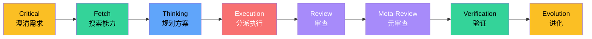
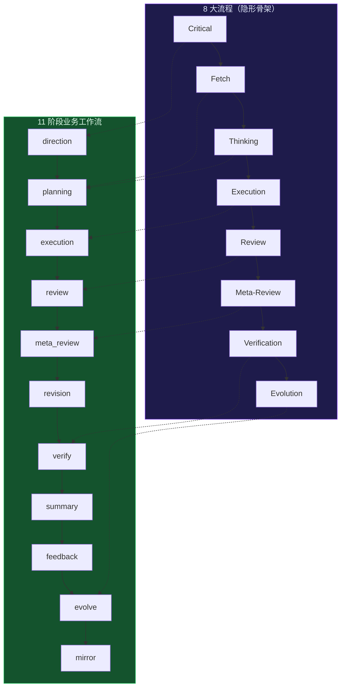
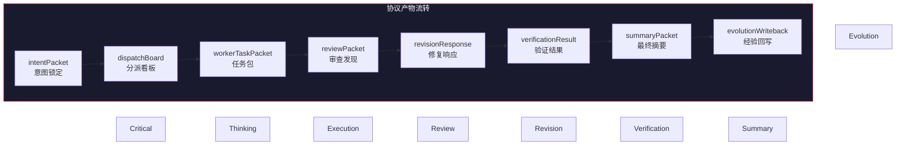
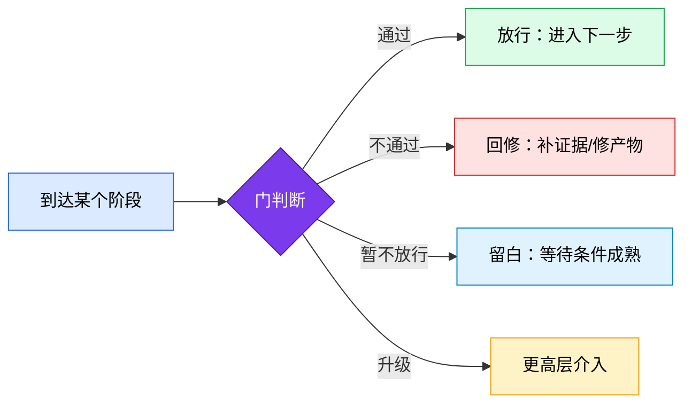
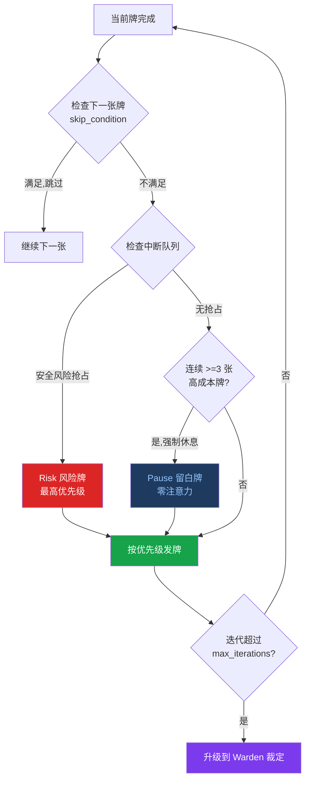
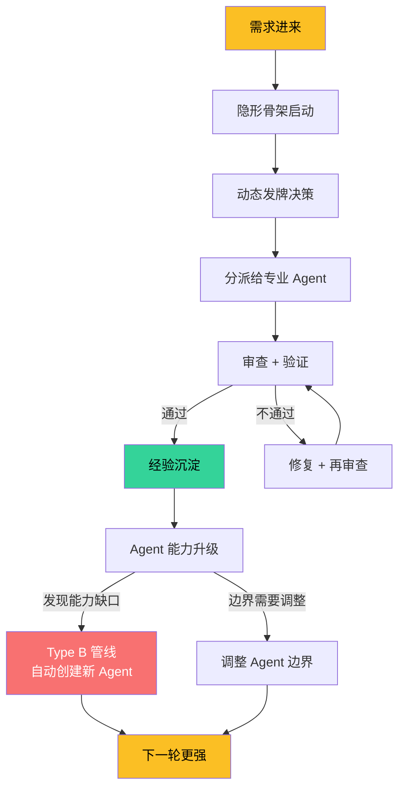
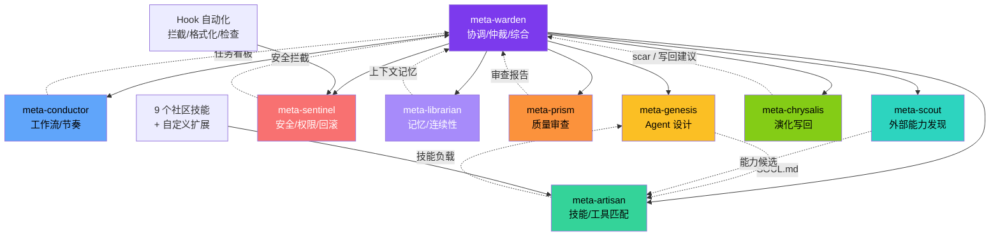
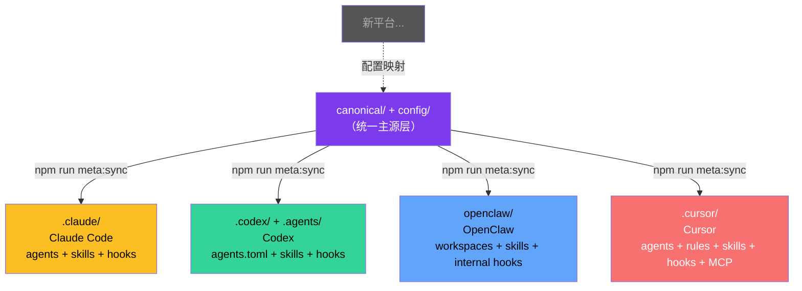
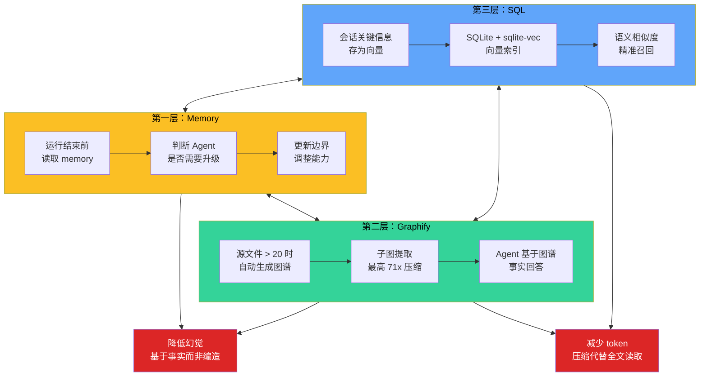

<div align="center">

<h1 style="font-size: 6em; font-weight: 900; margin-bottom: 0.2em; letter-spacing: 0.1em;">元</h1>
<p style="font-size: 1.2em; color: #7c3aed; font-weight: 600; margin-top: 0;">META_KIM</p>

<p>
  语言：
  <a href="README.md">English</a> |
  <a href="README.zh-CN.md">简体中文</a> |
  <a href="README.ja-JP.md">日本語</a> |
  <a href="README.ko-KR.md">한국어</a>
</p>

<p>
  
  
  
</p>

<p>
  
</p>

</div>

## 简介

**Meta_Kim** 不是又一个 AI 编码工具。它是 AI 编码工作的治理层。

AI 编码现在最难的，已经不是让模型改文件。真正难的是：先做什么、该由什么能力负责、怎么证明真的做对、这次经验怎么在下一轮继续复用。

打个比方：你现在用的 Claude Code、Codex、OpenClaw、Cursor，本质上都是"手"——能写代码、能改文件。但谁来决定先改哪个文件？改完谁来检查？检查出了问题谁来修？修完了怎么保证下次不会再犯同样的错？

Meta_Kim 就是干这个的。它是**AI 之上的 AI**——一套统一的治理逻辑，让复杂任务不再是一锅乱炖。

### 一句话总结

> **先搞清楚要干什么 → 再决定谁去干 → 干完审查 → 审完沉淀经验 → 经验反哺下一轮。**

这不是什么新概念，这就是任何成熟工程团队都在做的事情。只不过 Meta_Kim 把它变成了一套可运行的系统，而不是靠人的自觉。

### Before / After

| 没有 Meta_Kim | 使用 Meta_Kim |
|---|---|
| 一个超长聊天回复试图包办所有事 | 任务会经过意图、能力、owner、审查、验证、写回 |
| 因为某个工具能用，所以就直接用它 | 因为某个能力适合当前任务、工具端、OS、依赖和风险，才选择它 |
| 命令跑绿就被误认为目标完成 | 证据必须回到用户真实目标上验收 |
| 好经验沉没在聊天记录里 | 可复用经验会沉淀成 skill、agent、script、contract 或一次性任务 |

### 3 分钟证明

Meta_Kim 最好不是靠读完整套规则理解，而是先看一次 governed run。

```bash
npm run meta:theory:demo
npm run meta:run-status:latest
npm run meta:theory:report -- --run-id latest
npm run meta:delivery:bundle
```

这条证明链会展示五件事：

- 模糊需求会先变成明确意图和成功标准
- 先搜索能力，再决定谁执行
- 复杂任务会拆成有边界的 worker task，而不是一段万能聊天回复
- Review 和 Verification 会留下产物证据，而不是只给安慰性结论
- 兼容证据会保持分层，smoke evidence 不会被冒充成 native live proof

带着示例看第一遍：[`examples/first-run/README.md`](examples/first-run/README.md)。

## 快速开始

如果你只想先装上试用，直接运行：

```bash
npx --yes github:KimYx0207/Meta_Kim meta-kim
```

或者按传统方式：

```bash
git clone https://github.com/KimYx0207/Meta_Kim.git
cd Meta_Kim
npm install
node setup.mjs
```

> 💡 **安装之后**：`setup.mjs` 结尾会打印产物位置。任何时候想再看一眼（或对比上次安装），在安装目录里跑 `npm run meta:status` 即可。

如果你准备维护仓库，优先改主源：`canonical/agents/`、`canonical/skills/meta-theory/`、`config/contracts/`、`config/capability-index/`，然后执行（需 Node.js >= 22.13.0）：

```bash
npm run meta:sync
npm run meta:validate
```

建议阅读顺序：

1. 本文件 `README.zh-CN.md`
2. `AGENTS.md`
3. 维护 Claude Code 行为时读 `CLAUDE.md`
4. 维护 Cursor rules 时读 `canonical/runtime-assets/cursor/rules/meta-enforcement.mdc`

### 使用路径

全局安装后（`node setup.mjs` 或 `npx`），人类应该直接用自然语言说任务。斜杠命令只保留为维护者快捷方式，不是普通用户入口。

| 你在哪里 | 自动生效的部分 | 人类怎么输入 |
|---|---|---|
| Meta_Kim 仓库 + Claude Code | 完整治理（CLAUDE.md 提供 8-stage spine、门、分发规则） | 直接说任务；需要 durable 处理的工作会进入治理路线 |
| 任意其他项目 + Claude Code | Hooks（安全拦截、格式化、记忆保存）+ meta-theory skill | 直接说任务；`/meta-theory` 只是维护者快捷方式 |
| Codex | AGENTS.md 规则 + 9 个自定义 agent + meta-theory command | 直接说任务；Codex 会区分 durable 工作、主观模糊输入和纯查询 |
| OpenClaw | 兼容 workspace agent、skill、config 和 internal lifecycle hooks | 需要配置 OpenClaw config/auth；提交者必须先在 OpenClaw 自己完成严格自测并提供证据，证据通过审查后才能合并 |
| Cursor | 兼容官方 subagents、`.cursor/rules`、hooks、skills 和 MCP 镜像 | 提交者必须先在 Cursor 自己完成严格自测并提供证据，证据通过审查后才能合并 |

### 平台支持分层

Meta_Kim 现在把平台支持分成几层，而不是把所有“看起来兼容”的平台都说成完整工具端投影。

| 层级 | 产品 | 含义 |
|---|---|---|
| 正式工具端投影 | Claude Code、Codex、OpenClaw、Cursor | canonical 治理层会同步成对应工具端文件，并由 `npm run meta:sync` / `npm run meta:check` 校验。 |
| 原生依赖安装目标 | opencode、Qwen、Zed、Gemini、CodeBuddy、Antigravity、JoyCode | ECC 上游安装器支持这些目标，但 Meta_Kim 不会在没有 profile、layout、sync、测试前宣称完整工具端投影。 |
| 候选 probe | Qoder CLI、Trae、Kiro、Windsurf / Devin Desktop Cascade、Cline、Roo Code、Continue | 官方文档暴露了 rules / instructions、skills、agents / modes、hooks、MCP、commands、memory 或 permission controls 等可兼容原始能力；Meta_Kim 先记录为候选兼容，不宣称正式支持。 |

事实源：`config/runtime-compatibility-catalog.json`。

能力表面兼容不等于工具端正式支持。一个工具可以共享 Meta_Kim 可映射的原始能力，但仍必须补齐 adapter 设计、profile/layout 生成、sync 测试和 live 验证，才可以升级为正式投影。

---

## 联系方式


GitHub <a href="https://github.com/KimYx0207">KimYx0207</a> |
X <a href="https://x.com/KimYx0207">@KimYx0207</a> |
官网 <a href="https://www.aiking.dev/">aiking.dev</a> |
微信公众号：**老金带你玩AI**

飞书知识库：
<a href="https://my.feishu.cn/wiki/OhQ8wqntFihcI1kWVDlcNdpznFf">长期更新入口</a>

### 请我一杯咖啡

如果 Meta_Kim 帮到了你，欢迎请我喝杯咖啡，算是对持续维护的支持。

<table align="center">
<tr><th>微信支付</th><th>支付宝</th></tr>
<tr>
<td align="center"></td>
<td align="center"></td>
</tr>
</table>

### 方法依据

Meta_Kim 的方法论基础来自本项目维护者（KimYx0207）撰写的"基于元的意图放大"研究：

- 论文：<https://zenodo.org/records/18957649>
- DOI：`10.5281/zenodo.18957649`

---

## 架构：隐形骨架 + 动态发牌

这是 Meta_Kim 最核心的设计思想。整篇文档最重要的就是这一节。

### 先把核心词拆开，不然后面一定会混

| 概念 | 它是什么 | 它不是什么 |
| --- | --- | --- |
| **隐形骨架** | 表层流程下面必然存在的后台框架节点 | 一张先天写死的职责清单 |
| **8 大流程** | 隐形骨架在执行层露出的人可读主链 | 全部治理逻辑本身 |
| **11 阶段业务工作流** | 复杂 run 被判断后叠加的 run 包装递进方式 | 8 大流程的替代物 |
| **发牌** | 围绕 8 大流程和 agent 单元做动态管控 | 简单派任务 |
| **门** | 放行条件 | 阶段本身 |
| **协议** | 节点必须交出的结构化东西 | 口号或抽象价值观 |
| **agent 单元治理** | 让边界、能力、升级、回滚有抓手 | 角色菜单 |
| **三层记忆体系** | memory / graphify / SQL 分工协作的长期记忆 | 一份大杂烩笔记 |

如果你只想记住一句话：

> **8 大流程负责推进，门负责准入，协议负责交付，发牌负责动态介入。**

### 8 大流程 = 隐形骨架

Meta_Kim 有 8 个固定的执行阶段，我管它叫**隐形骨架**：



**Critical — 先把真实问题钉住，不让后面全程建立在误解上**

需求模糊时追问澄清，而不是猜。这一步产出 `intentPacket`（意图锁定），把真实用户意图、成功标准、排除范围全写死。如果需求已经清晰，系统显式记录跳过原因，不是偷偷跳过。

**Fetch — 先找已有能力，而不是上来就自己发明**

搜索现有 agent、skill、工具、MCP 能不能覆盖这个需求。这一步的核心理念是**能力优先**——先定义需要什么能力，再搜索谁声明了这个能力，最后派给最匹配的 owner。能力索引查找顺序是 `config/capability-index/` → 工具端镜像 → 本地库存 → fallback，而不是一开始就写死一个 agent 名字。

**治理决策引擎**

Meta_Kim 不只是 8 阶段。它会先识别治理触发条件，再查平台能力、OS 兼容、依赖项目能力，接着分离 owner 与 weapon，根据 Win/Mac/工具端过滤可执行路径，只在关键分叉点给用户选择项，自动执行确定性部分，再验证用户目标是否真的落地，最后把经验写回供下次复用。只作为参考的项目会被吸收成 Meta_Kim 自己的数据，不会被悄悄升级成依赖；见 `config/governance/decision-pattern-catalog.json`。

**Thinking — 定义边界、owner、顺序、交付物、风险和停机条件**

把任务拆成子任务，给每个子任务指定 owner，明确依赖关系和并行分组。这一步产出 `dispatchBoard`（分派看板）——谁干什么、哪些可以并行跑、最终谁负责合并。同时要探索至少 2 条方案路径，不能只走一条路。

**Execution — 真正产生产物，但此时仍然处于被治理状态**

分派给专业 agent 执行。每个子任务打包成 `workerTaskPacket`，包含完整的文件上下文、约束条件、审查 owner 和验证 owner。独立子任务并行跑，不串行拖慢。**执行 ≠ 完成**——产出物后面还要过审查和验证。

**Review — 站在质量和边界角度检查当前执行是否靠谱**

审查代码质量、安全性、架构合规、边界越界检测。产出 `reviewPacket`，里面是结构化的审查发现（findings）。每个发现都有严重等级，从 CRITICAL 到 LOW。这一步不是走过场——发现没关就不能往前推。

**Meta-Review — 反过来审视 review 标准本身是不是偏了、漏了、松了**

审查"审查"。如果 review 标准本身太松，等于没审；如果标准偏了，等于审错了方向。这一步保证审查系统的质量，而不是只保证被审代码的质量。

**Verification — 确认真实世界里确实成立，而不是文本上看起来像成立**

验证修复是否真的把 review finding 关了。产出 `verificationResult` + `closeFindings`。如果修复没关上 finding，回修再验证，直到闭合。这步是最诚实的关卡——文本上看起来修了不等于真修了。

**Evolution — 把本轮能力缺口、可复用模式、升级需求写回系统**

把经验沉淀成结构性升级：可复用模式写入 memory，失败记录成伤疤，能力缺口标记给 Scout 追踪，agent 边界调整写回 canonical。每轮必须给出 `writebackDecision`——要么明确写回目标，要么说明为什么没有可落盘的内容。**不沉淀经验的 run 等于白干。**

---

这 8 个阶段合在一起就是执行脊柱。

为什么是"相对"固定？因为有些阶段在简单场景下可以跳过——但系统会显式记录跳过的原因，不是偷偷跳过。

### 11 阶段业务工作流 = 骨架之上的递进工作流

如果 8 大流程是骨架，那 11 阶段业务工作流就是在这个骨架上长出来的 **run 包装递进方式**：

```
direction → planning → execution → review → meta_review → revision → verify → summary → feedback → evolve → mirror
```

它不是另起一套，而是从 8 大流程**派生**出来的。区别在于：

- **8 大流程**偏向执行逻辑——"按什么顺序干活"
- **11 阶段**偏向业务治理——"每个阶段要交付什么、怎么算完成、交付物怎么流转、镜像何时刷新"



11 阶段业务工作流额外多了 `revision`（修订）、`summary`（总结）、`feedback`（反馈）、`mirror`（镜像）这些环节，让整个流程不仅仅是"做完"，还要"做好"、"做对"，并把 Claude/Codex/Cursor/OpenClaw 工具端镜像同步到位。

### 协议 = 每个节点必须交出什么

光有流程不够，还得规定每个环节**必须交出什么产物**。这就是协议。

Meta_Kim 的协议不是口头约定，是**结构化的数据包（packet）**：

| 协议产物 | 哪个阶段 | 作用 |
| --- | --- | --- |
| `intentPacket` | Critical | 锁定真实意图，防止执行过程中跑偏 |
| `dispatchBoard` | Thinking | 谁干什么，依赖关系，并行分组 |
| `workerTaskPacket` | Execution | 每个子任务的完整上下文包 |
| `reviewPacket` | Review | 审查发现的结构化记录 |
| `revisionResponse` | Revision | 对每个审查发现的修复响应 |
| `verificationResult` | Verification | 修复是否真的把问题关了 |
| `summaryPacket` | Summary | 对外发布前的最终摘要 |
| `evolutionWriteback` | Evolution | 经验回写目标 |



这些协议产物不是可有可无的文档——它们是系统运行的**事实来源**。没有协议，下一节点其实不是在"接力"，而是在"猜上一个节点到底想表达什么"。这就是很多 AI 协作一到复杂任务就开始失真的原因。

当前实现中的协议载体：执行前有 `taskClassification`，发牌前有 `cardPlanPacket`，分发前有 `dispatchEnvelopePacket`，review 之后有 `reviewPacket.findings`，revision 与 verify 之间有 `revisionResponses` + `verificationResults` + `closeFindings`，对外发布前有 `summaryPacket`，进入进化前有 `writebackDecision`。

`npm run meta:validate:run` 会校验这些产物链是否完整闭合。

### 门 = 阶段到了不代表已经过门

协议规定每个节点**必须交出什么**，门规定这些东西**够不够放行**。

一句话说死：

> **阶段说明你走到哪儿，门说明你配不配往前走。**



当前系统里的关键门：

| 门 | 把什么关 | 放行条件 |
| --- | --- | --- |
| **planning gate** | 从规划进入执行前 | 边界、owner、交付物、风险都定了 |
| **metaReview gate** | 元审查够不够格 | 审查标准本身没偏、没漏、没松 |
| **verify gate** | 修复是不是真的关了 | finding → revision → verification 闭合 |
| **summary gate** | 能不能对外发布 | 验证通过 + 摘要完成 |
| **publicDisplay gate** | 能不能宣称"已完成" | verifyPassed + summaryClosed + singleDeliverableMaintained + deliverableChainClosed |

最关键的是 **publicDisplay gate**——没有通过验证、摘要未闭合、交付链断裂，就不能假装"做完了"。

门和协议的关系：

- **协议**解决"节点必须交出什么"——偏交付契约
- **门**解决"这些东西够不够放行"——偏准入判定
- 没有协议，门没有判断依据；没有门，协议就是走过场

### 动态发牌 = 补充隐形框架的灵活性

8 大流程的骨架相对固定，但现实中的任务千变万化，不可能一套固定流程覆盖所有场景。所以 Meta_Kim 引入了**动态发牌机制**。

发牌对应 8 大流程，但不是简单的 1:1 映射。10 张牌如下：

| 牌 | 触发条件 | 注意力成本 |
| --- | --- | --- |
| **Clarify（澄清）** | 需求模糊 | 低 |
| **Shrink scope（范围收缩）** | 仓库太大、文件太多 | 低 |
| **Options（方案）** | 需求清晰但路径很多 | 中 |
| **Execute（执行）** | 方案确定 | 高 |
| **Verify（校验）** | 执行完成 | 中 |
| **Fix（修复）** | 校验失败 | 中 |
| **Rollback（回滚）** | 风险扩散 | 高 |
| **Risk（风险）** | 涉及安全/全局/多方 | 高 |
| **Nudge（建议）** | 用户卡住了，轻轻推一下 | 低 |
| **Pause（留白）** | 连续 3 张高成本牌后强制休息 | 零 |

关键在于：**部分牌是动态的**。它们能补充隐形框架相对较死的逻辑：

- 当 3 张高注意力牌连续打出时，系统会**强制插入 Pause（留白）**——不是等用户提醒，是自己知道该停了
- 当安全风险出现时，**Risk 牌会抢占**，打断当前流程
- 当用户已经知道某些信息时，对应的牌会被**跳过**——不做无用功
- 当任务迭代超过上限时，系统会**升级到 Warden 裁定**——不会无限循环

发牌机制让固定骨架有了"呼吸感"——该严的地方严（8 大流程不变），该灵活的地方灵活（动态牌补充）。



### 闭环 = 不断迭代 + 不断生成 + 不断提升

有了骨架、递进流程、协议、动态发牌，就形成了一个**完美闭环**：

```
需求进来 → 骨架启动 → 发牌决策 → 分派执行 → 审查验证 → 经验沉淀 → agent 升级 → 下一轮更强
```

这个闭环不是一次性的。每一轮都会：

1. **生成对应的 agent**——如果发现能力缺口，系统会通过 Type B 管线自动创建新 agent
2. **提升 agent 的能力**——通过 Evolution 回写，agent 的 SOUL.md、技能负载、工具链都会持续优化
3. **明确每个 agent 的边界**——每个 agent 只管一类事，越界会被 Sentinel 拦截



### Agent 边界 + 技能集成

9 个元角色各管一摊，边界清晰：

| 角色 | 职责 | 不管什么 |
| --- | --- | --- |
| **meta-warden** | 协调、仲裁、最终综合 | 不直接写代码 |
| **meta-conductor** | 工作流、节奏控制 | 不做安全检查 |
| **meta-genesis** | Agent 设计、SOUL.md | 不管工具选型 |
| **meta-artisan** | 技能、MCP、工具匹配 | 不管 agent 人设 |
| **meta-sentinel** | 安全、权限、回滚 | 不管节奏编排 |
| **meta-librarian** | 记忆、连续性 | 不管代码执行 |
| **meta-prism** | 质量审查、反糊弄 | 不管能力搜索 |
| **meta-scout** | 外部能力发现 | 不管内部协调 |
| **meta-chrysalis** | 演化写回、scar 记录、递归安全门 | 不演化自己，也不绕过 Warden gate |

每个 agent 可以集成各种强大的 **skill**（技能）和 **command**（命令），按需加载。Meta_Kim 预装了 9 个社区技能，也支持自定义扩展。



### Hook 自动化

在 Claude Code 中，Meta_Kim 通过 **Hook** 实现自动化：

- **危险命令拦截**：`rm -rf`、`DROP TABLE` 等操作会被自动阻断
- **Git push 提醒**：推送前自动提醒你检查
- **格式化**：编辑 JS/TS 文件后自动格式化
- **类型检查**：编辑后自动跑 TypeScript 检查
- **console.log 警告**：写了 console.log 会提醒你删掉
- **会话结束审计**：会话结束前检查是否有遗留问题
- **会话结束记忆保存**：会话结束时将摘要写入 MCP Memory Service
- **子 agent 上下文注入**：自动给子 agent 注入项目上下文

这些 Hook 不是可选的锦上添花——它们是治理系统的执行层保障。

### 跨平台映射

**整个架构可以映射到任何支持 agent 且支持 agent-to-agent 通信的项目上。**

Meta_Kim 当前已经映射了 4 个平台：

| 平台 | 状态 | 映射方式 |
| --- | --- | --- |
| **Claude Code** | 完整支持 | `.claude/agents/*.md` + `SKILL.md` + hooks + MCP |
| **Codex** | 完整支持 | `.codex/agents/*.toml` + `.agents/skills/` + commands + hooks |
| **OpenClaw** | 兼容的正式投影 | `openclaw/` workspaces + skills + internal hooks；更强工具阻断改造需提交者先在 OpenClaw 自己完成严格自测并提供证据，证据通过审查后才能合并 |
| **Cursor** | 兼容的正式投影 | `.cursor/agents/*.md` + `.cursor/rules/*.mdc` + skills + hooks + MCP；Cursor 改造需提交者先在 Cursor 自己完成严格自测并提供证据，证据通过审查后才能合并 |

主源层由 `canonical/agents/`、`canonical/skills/meta-theory/`、`config/contracts/`、`config/capability-index/` 组成，再通过同步脚本（`npm run meta:sync`）镜像 / 投影到不同平台的文件结构。



你可以通过配置**不断补充新的平台映射**——只要那个平台支持 agent 和 agent 间通信。

Claude/Codex/Cursor/OpenClaw 四个工具端都是 Meta_Kim 的正式投影，但原生能力表面不同。Claude Code 和 Codex 都是完整支持。OpenClaw 与 Cursor 是兼容的正式投影；增强这两端的 PR 需要提交者先在对应工具端自己完成严格自测并提供证据，证据通过审查后才能合并。

| 能力面 | Claude Code | Codex | OpenClaw | Cursor |
| --- | --- | --- | --- | --- |
| **agent** | 原生 agents/subagents，项目级与用户级都成熟 | custom agents/subagents 很强 | workspace 型 agent，支持 agent-to-agent | 官方 `.cursor/agents` subagents 与项目规则兼容治理上下文 |
| **skill/references** | 原生 skill、references、全局技能生态完整 | `.agents/skills/` 是项目 skill 根 | workspace skill + installable skill | 项目 skill/reference 镜像 |
| **hook/自动化** | 项目级 hooks + settings.json + 插件生态 | 可信 `.codex/hooks.json` 项目/用户 hooks | internal lifecycle hooks；阻断/取消策略需要 typed plugin hooks | `.cursor/hooks.json` lowerCamel lifecycle hooks，支持 `preToolUse` / `failClosed` |
| **MCP/配置** | 原生 MCP 与配置面完整 | 可接工具端 adapter 与 MCP | workspace config 明确 | 项目 MCP 与配置镜像 |
| **治理闭环支持** | 通过 Claude-native 表面完整支持 | 通过 Codex-native 表面完整支持 | 通过 OpenClaw-native 表面兼容；typed plugin 工具阻断改造需提交者严格自测并提供证据，证据通过审查后才能合并 | 通过 Cursor-native 表面兼容；项目决策卡与官方 hook gate 保持兼容语义 |

重点不是排座次，而是兼容纪律：每个正式工具端都保留自己的 agent、skill、hook、MCP、选择面和配置面，不把某一个宿主格式伪装成通用格式。

### 仓库四层承载结构

| 层 | 位置 | 作用 |
| --- | --- | --- |
| **canonical 主源** | `canonical/agents/`、`canonical/skills/meta-theory/`、`config/contracts/`、`config/capability-index/` | 长期维护优先改这里 |
| **工具端镜像** | `.claude/`、`.codex/`、`openclaw/`、`.cursor/` | 同一能力在不同工具端的镜像 |
| **本地状态** | `.meta-kim/state/{profile}/`、`.meta-kim/local.overrides.json` | profile 级状态、run index、continuity |
| **脚本与校验** | `scripts/`、`npm run *` | 同步、校验、发现、验收 |

### 三层状态层（项目级 / 全局级 / 本地级）

这三层最容易混，必须分开理解：

| 层级 | 承载位置 | 决定什么 |
| --- | --- | --- |
| **项目级** | 当前仓库的 `canonical/`、`config/contracts/`、`config/capability-index/`、工具端投影、文档、脚本 | 这个项目自己定义了什么 |
| **全局级** | `~/.claude/`、`~/.codex/`、`~/.openclaw/`、`~/.cursor/`、`~/.meta-kim/global/` | 这台机器上还能发现什么 |
| **本地级** | `.meta-kim/state/{profile}/run-index.sqlite`、`compaction/`、`profile.json` | 这次 run 在这个 profile 下留下了什么 |

#### `.meta-kim/` 里面都有什么？

`.meta-kim/` 就是 Meta_Kim 的本地存档目录。它干三件事：

**1. 记住你的选择** — `local.overrides.json`

你第一次跑 `node setup.mjs`，选了"我要用 Claude Code 和 Codex"，这个选择就存在这里。下次跑 setup 不用重新选。

*例子：你电脑上装了 Claude Code、Codex、OpenClaw 三个，但你只想用前两个。这个配置就存在这里，所有脚本读这个文件来决定往哪装技能。*

**2. 记录工作历史** — `state/{profile}/run-index.sqlite`

假设你用 Meta_Kim 的治理流程做了一件事——比如"用 8-stage spine 审查了一段代码"。这个审查的结果记录（叫 run artifact）可以被索引进 SQLite 数据库，以后能查"上次审查了啥、谁审查的、结果怎样"。

*例子：你上周让 meta-prism 审查了认证模块，这周又改了认证模块。系统查 `.meta-kim/state/` 就能知道"上次审查发现了 3 个问题，修复了 2 个，还剩 1 个没修"，不用你重复说。*

**3. 跨会话恢复** — `state/{profile}/compaction/`

你跟 Claude Code 聊到一半，token 用完了，会话断了。compaction 包把你当前做到哪一步、哪些待办没完成存下来，下次开新会话时能接着干。

*例子：你让 Meta_Kim 做一个复杂的多文件重构，做到第 6 步断了。下次开新会话，系统从 compaction 包读到"做到第 6 步了，第 7 步还没开始"，直接从第 7 步继续，不用从头来。*

**其他文件：** `doctor-cache/` 存储每次 `npm run meta:doctor:governance` 的执行结果，`migrations/` 追踪版本间的数据结构升级，`profile.json` 存 profile 元信息。全部由脚本自动管理，你不需要手动编辑。

**快速参考：**

| 路径 | 作用 | 什么时候写入 |
| --- | --- | --- |
| `local.overrides.json` | 记住你选了哪些工具端 | 自动 — 首次运行 `setup.mjs` |
| `state/{profile}/profile.json` | Profile 元信息（创建时间、名称） | 自动 — `setup.mjs` 创建 `default` profile |
| `state/{profile}/run-index.sqlite` | 治理 run 的索引记录 — 谁跑了什么、发现了什么、还有什么没解决 | 按需 — `npm run meta:index:runs -- <artifact>` |
| `state/{profile}/compaction/` | 跨会话接力包：未完成的步骤、待处理的发现、未关闭的验证门 | 按需 — 治理 run 需要跨会话恢复时写入 |
| `state/{profile}/doctor-cache/` | `npm run meta:doctor:governance` 的缓存结果 | 按需 — `doctor:governance` 写入 |
| `state/{profile}/migrations/` | 状态迁移追踪（Meta_Kim 版本间的 schema 升级） | 自动 — 状态 schema 在版本间变化时 |

### 全局安装后哪些能力能用

Meta_Kim 的门和协议有四层执行保障。全局安装（`node setup.mjs`）后，在任何项目中使用时：

| 执行层 | 全局安装后能用 | 需要 Meta_Kim 仓库 |
| --- | --- | --- |
| **Prompt 层**（agents + skills 中定义的门和协议规则） | 能用 — 安装到 `~/.claude/skills/` 和 `~/.claude/agents/`，AI 读 prompt 就会遵守 | — |
| **Hook 层**（会话结束时的门检查、记忆保存至 MCP Memory Service、危险命令拦截） | 能用 — 配置在 `.claude/settings.json` 中 | — |
| **配置层**（workflow-contract.json 中的协议字段定义） | 能用 — 协议规则已嵌入 skill prompt，AI 知道每个 packet 必须有哪些字段 | — |
| **代码校验**（`npm run meta:validate:run` 硬校验 packet 链闭合） | — | 需要 — 脚本在 `scripts/validate-run-artifact.mjs` |

前三层是主要防线，全局安装后在任何项目中都能工作。代码校验是最后一道兜底，需要回到 Meta_Kim 仓库目录运行（或将脚本路径指对）。

---

## 三层记忆体系

Meta_Kim 的记忆不是单一的。它有三层，各有分工，共同保障 agent 持续进化且对项目越来越熟。

三层记忆的激活方式各不相同：
- **第一层** 内置于 Claude Code——依赖 Claude Code 自带记忆机制（在 `~/.claude/projects/*/memory/` 自动读写）
- **第二层** 由 `node setup.mjs` 自动安装
- **第三层** 由 `node setup.mjs` 安装，但需要手动启动服务器（见下方第三层激活说明）

### 第一层：Memory（Agent 升级记忆）

- **负责什么**：Agent 的升级和持续学习
- **存储位置**：`.claude/projects/*/memory/`
- **工作机制**：每次运行结束前，系统会读取 memory 作为信息进行判断，决定 agent 是否需要升级、边界是否需要调整
- **核心价值**：让 agent 越用越聪明，而不是每次都从零开始
- **激活方式**：自动——AI 在每次会话中自动读写 memory
- **查询方式**：直接问 AI——"之前关于这个项目我们学到了什么？"

### 第二层：Graphify（项目级 LLM Wiki）

- **负责什么**：项目级别的代码知识图谱
- **存储位置**：`graphify-out/graph.json`（NetworkX 节点链接格式）；深度阅读可优先看同目录下的 `GRAPH_REPORT.md`
- **工作机制（数据面）**：`node setup.mjs` 可选步骤会安装 graphify、并**幂等**执行 `python -m graphify claude install` 与 `python -m graphify hook install`（即使 graphify 已通过 pip 安装过也会补全 hook）；git hook 在 commit/checkout 时触发当前仓库内图谱重建。`npm run meta:graphify:install` 行为与之一致（含 hook）。
- **工作机制（使用面）**：同步后的 `meta-theory` 里 Fetch Step 0.5 约定模型如何检测与使用图谱；**不是**后台常驻进程。Claude Code 子代理仅通过 `subagent-context.mjs` 收到**短提示**，不会自动把整份 `graph.json` 塞进上下文。Codex / OpenClaw / Cursor 无该 hook，但共享同一份 `dev-governance.md` 引用；其他工具端可在**目标仓库**按需执行 `python -m graphify codex install` 或 `python -m graphify claw install`（参见 `python -m graphify --help`）。
- **核心价值**：
  - 让记忆越来越熟悉项目——不是记住代码原文，而是理解代码的结构和关系
  - **大幅降低幻觉**——agent 不再凭记忆瞎编，而是基于图谱事实回答
  - **大幅减少 token 消耗**——通过子图提取代替原始文件读取，最高压缩 71 倍
- **质量门槛**：
  - 模糊节点 > 30% → 标记为低质量图谱，回退到直接文件读取
  - 总节点 < 10 → 图谱太稀疏，回退到 Glob/Grep
  - 存在"上帝节点"（入度过高）→ 标记为串行瓶颈
- **激活方式**：`node setup.mjs` 可选 Python 步骤或 `npm run meta:graphify:install`——安装/校验、networkx、Claude 侧注册、**当前仓库** git hook；图谱首次生成仍依赖 hook 触发或手动构建命令
- **查询方式**：`python -m graphify query "你的问题"`——用自然语言查询代码图谱

### 平台自动化对比

| 能力 | Claude Code | Codex | OpenClaw | Cursor |
| --- | --- | --- | --- | --- |
| PreToolUse hook（Glob/Grep 前自动提示） | ✅ settings.json | ✅ trusted `.codex/hooks.json` | ❌ | ✅ `.cursor/hooks.json` `preToolUse` |
| 斜杠命令 `/graphify` | ✅ | ✅ | ✅ | ✅ |
| git hook 自动重建（post-commit/checkout） | ✅ | ✅ | ✅ | ✅ |
| AGENTS.md 常驻规则 | 不适用 | ✅ | ✅ | ✅ |
| setup.mjs 多平台安装 | ✅ claude | ✅ codex | ✅ claw | ✅ cursor |

**核心洞察**：Claude Code、Codex 和 Cursor 都有原生 hook 配置，但 schema 不同。OpenClaw 使用自己的 internal/plugin hook 模型。

多平台安装请运行 `node setup.mjs`——它会遍历所有选中的平台，幂等执行 `graphify <platform> install`。

### 第三层：SQL（向量级会话检索）

- **负责什么**：项目会话的向量级存储和检索
- **存储方式**：SQLite + 向量扩展（sqlite-vec）
- **工作机制**：把每次会话的关键信息存为向量，下次通过语义相似度检索
- **核心价值**：
  - 跨会话连续性——上次聊到哪了，这次能接上
  • 向量级检索——不是关键词匹配，而是语义理解
  - 精准召回——从历史会话中找到最相关的上下文
- **激活方式**：`node setup.mjs` 安装并配置 MCP Memory Service（第三层），同时安装各工具端记忆 hook，并尝试在后台启动 HTTP 服务。
  - **Claude Code**：SessionStart Hook 和 Stop 记忆保存 Hook 在 `node setup.mjs` 时自动注册；会话启动时通过 `mcp_memory_global.py --mode session` 写入项目状态。
  - **Codex**：`~/.codex/hooks.json` 自动写入 SessionStart、UserPromptSubmit、Stop 桥接，调用 `meta-kim-memory-save.mjs`，覆盖开始 / 提示提交 / 结束。
  - **OpenClaw**：`~/.openclaw/hooks/mcp-memory-service` 自动安装 managed hook，覆盖 `command:new`、`command:reset`、`session:compact:after`、`command:stop`。
  - **Cursor**：`~/.cursor/hooks.json` 自动写入 `beforeSubmitPrompt` 和 `stop` 桥接，复用共享记忆 hook。
- **启动服务器**：`memory server --http`（macOS/Linux 需设置 `MCP_ALLOW_ANONYMOUS_ACCESS=true`；Windows PowerShell 使用 `$env:MCP_ALLOW_ANONYMOUS_ACCESS="true"`），然后访问 `http://localhost:8000`。
- **端口**：服务器和 Meta_Kim hooks 统一使用 `http://localhost:8000`。
- **Hook**：Claude Code、Codex、Cursor、OpenClaw 都会自动注册；各工具端使用自己的 hook 格式，但共享同一个 MCP Memory HTTP 端点。
- **MCP 注册与写入区别**：`.mcp.json` 只注册 MCP Memory server（`memory server`）供客户端访问；自动写入会话记忆由 lifecycle hooks 单独完成：Claude Code 使用 `stop-memory-save.mjs`，Codex/Cursor 使用 `meta-kim-memory-save.mjs`，OpenClaw 使用 managed `mcp-memory-service` hook。
- **查询**：`npm run meta:query:runs -- --owner <agent>`——按 agent 查找历史 run，或 `npm run meta:index:runs -- <artifact>` 手动索引 run 产物
- **故障排除**：
  - **Windows 上 Python hook 失败**：如果 SessionStart hook 返回退出码 49 或无输出，可能是 Python 命令指向 Windows Store 占位符。运行 `node scripts/install-mcp-memory-hooks.mjs` 可自动检测并修复。安装程序现在会跳过 WindowsApps 占位符，优先使用 `LOCALAPPDATA\Programs\Python*` 下的真实 Python。使用 `--force` 参数可强制重新注册。
  - **检查安装状态**：运行 `node scripts/install-mcp-memory-hooks.mjs --check` 验证 hook 状态和 Python 路径有效性。
  - **手动验证**：用 `python --version` 或检测到的路径（如 `"C:/Users/你的用户名/AppData/Local/Programs/Python/Python311/python.exe" --version`）测试 Python 命令。

### 三层协同



三层记忆共同作用，实现两个核心目标：

1. **大幅降低幻觉**——agent 不凭空编造，基于事实和上下文回答
2. **大幅减少 token 消耗**——用图谱压缩代替全文读取，用向量检索代替暴力搜索

---

## 运维命令速查

### 日常使用

| 命令 | 作用 |
| --- | --- |
| `node setup.mjs` | 交互式安装/更新/检查向导 |
| `git pull --ff-only` | clone 安装用户先用它从 GitHub 拉取最新 Meta_Kim 源码 |
| `node setup.mjs --update` | 刷新当前安装的投影、技能和依赖；不会拉取 Meta_Kim 源码 |
| `node setup.mjs --update --project-dir <目录> --project-dir <目录>` | 更新指定项目目录里的项目级运行时文件 |
| `node setup.mjs --update --all-projects` | 更新已保存项目目录里的项目级运行时文件 |
| `node setup.mjs --check` | 环境检查（不写盘） |
| `node setup.mjs --lang zh-CN` | 指定中文界面 |

项目目录更新只会作用于你选择、通过 `--project-dir` 传入，或保存复用的目录。
如果用脚本传入目录，可以加 `--save-project-dirs` 保存这组目录，后续用
`--all-projects` 复用。已有本地 `settings`、MCP 和 hook 配置会被合并或保留，
不会被直接替换。

交互式更新流程：

1. 运行 `node setup.mjs --update`。
2. 如果已经保存过项目目录，选择“更新全部已保存项目目录”即可一次更新。
3. 第一次配置时，选择“添加或修改已保存项目目录，并立即更新”。
4. 在一行里输入项目目录，多个目录用分号或逗号隔开：
   `D:/Project/a; D:/Project/b; D:/Project/c`。
5. 记住的目录会保存到本 Meta_Kim 仓库的 `.meta-kim/local.overrides.json`，
   字段名是 `projectDeployDirs`；后续可运行 `node setup.mjs --update --all-projects`
   一次更新所有已保存项目。

### 同步与校验

| 命令 | 作用 |
| --- | --- |
| `npm run meta:sync` | 从 canonical 同步到四端 |
| `npm run meta:check:runtimes` | 检查四端是否同步 |
| `npm run meta:validate` | 项目完整性校验 |
| `npm run meta:verify:all` | 全量校验（含工具端 smoke） |
| `npm run meta:doctor:governance` | 治理健康体检 |

### 当前有效规则在哪里

| 场景 | 当前源头 |
| --- | --- |
| 仓库 / Codex 规则 | `AGENTS.md` |
| Claude Code 规则 | `CLAUDE.md` |
| Meta-theory skill | `canonical/skills/meta-theory/SKILL.md` |
| Meta-theory 细节 | `canonical/skills/meta-theory/references/` |
| Cursor 声明式兜底规则 | `canonical/runtime-assets/cursor/rules/meta-enforcement.mdc` |
| 工具端镜像 | 运行 `npm run meta:sync` 后生成到 `.claude/`、`.codex/`、`.cursor/`、`openclaw/` |

拿不准时，先改 canonical 源，再跑 `npm run meta:sync` 和 `npm run meta:check`。

### 怎么判断这么多脚本哪些有用

先看 `package.json` 的 scripts。日常维护只认 README 里列出的 `meta:*` 命令；`scripts/` 下大多数文件是这些命令调用的内部 helper。正常使用从 `npm run meta:status`、`npm run meta:check`、`npm run meta:verify:all` 开始。只有当某个 `package.json` 命令或测试指向具体 helper 时，才需要单独看那个脚本。

### 技能与依赖

| 命令 | 作用 |
| --- | --- |
| `npm run meta:deps:install` | 按默认 Claude Code + Codex 主链安装 9 个社区技能到全局 |
| `npm run meta:deps:install:all-runtimes` | 显式安装到 Claude Code、Codex、OpenClaw、Cursor |
| `npm run meta:deps:install:claude-plugins` | 只安装 Claude Code marketplace plugin |
| `npm run discover:global` | 扫描全局能力 |
| `npm run meta:sync:global` | 同步 meta-theory 到用户级 |

`planning-with-files` 是核心外部依赖，不是项目内 `.agents/skills/` 镜像。安装依赖后应检查工具端 home，例如 `~/.codex/skills/planning-with-files/`、`~/.claude/skills/planning-with-files/`、`~/.cursor/skills/planning-with-files/` 或 `~/.openclaw/skills/planning-with-files/`。不能只因为 `.agents/skills/planning-with-files/` 不存在就判断它没装。

#### Plugin 市场类 skill（Superpowers、Everything Claude Code、cli-anything）

Superpowers 在 Claude Code、Codex 和 Cursor 都有原生 plugin 入口。Meta_Kim 不再把 Codex / Cursor 的 `skills/superpowers` fallback 当成正确插件安装；更新时会清理旧版 Meta_Kim 写入的 fallback 目录，并提示用户走宿主原生插件入口。

对没有原生插件入口的 plugin bundle，安装脚本仍会从 upstream bundle 按工具端优先级抽取对应子目录（sparse-checkout）：

| 工具端 | 优先链 |
| --- | --- |
| Claude Code | 原生 `claude plugin install <spec>@<marketplace>`（无 `claudePlugin` 字段的 skill 走 `skills/` 回退） |
| Codex | Superpowers 走 Codex 插件 UI 或 `/plugins`；其他 bundle 再按 `.codex/` → `.codex-plugin/` → `skills/` 回退 |
| Cursor | Superpowers 走 `/add-plugin superpowers` 或 Cursor 插件市场；其他 bundle 再按 `.cursor/` → `.cursor-plugin/` → `skills/` 回退 |
| OpenClaw | `skills/` |
| opencode | ECC 使用 `npx --yes --package ecc-universal@latest ecc install --profile core --target opencode`；其他 bundle 按 `.opencode/` → `skills/` 回退 |
| Qwen | ECC 使用 `npx --yes --package ecc-universal@latest ecc install --profile core --target qwen` |
| Zed、Gemini、CodeBuddy、Antigravity、JoyCode | ECC 是项目本地安装：在每个项目根目录运行 `npx --yes --package ecc-universal@latest ecc install --profile core --target <target>` |
| Qoder CLI | 仅 candidate probe：通用 bundle 探测可以看 `.qoder/` → `skills/`，但 ECC 不会对 Qoder 执行安装，因为上游 `ecc install --help` 当前没有 `qoder` |
| Trae、Kiro、Windsurf / Devin Desktop Cascade、Cline、Roo Code、Continue | 仅 candidate probe：兼容原始能力已进入 `config/runtime-compatibility-catalog.json`，但没有 adapter、sync 路径和验证套件前不会安装或投影 |

抽取结果装到 `~/.<tool>/skills/<id>/`。安装/更新时直接回车会走 Claude Code + Codex 主链；只装 Claude 市场 plugin：`npm run meta:deps:install:claude-plugins`；显式覆盖 Claude Code、Codex、OpenClaw、Cursor：`npm run meta:deps:install:all-runtimes`。**升级用户无需手动清理**：老版本的整 repo clone 残留会通过目标目录下的 `.claude-plugin/` 标志自动识别；旧版 Codex/Cursor `skills/superpowers` fallback 也会在更新时移除，并提示安装原生插件。

### 高级运维

| 命令 | 作用 |
| --- | --- |
| `npm run meta:validate:run -- <file.json>` | 校验治理 run 产物 |
| `npm run meta:eval:agents` | 轻量工具端 smoke 测试 |
| `npm run meta:eval:agents:live` | 带实时 prompt 的验收 |
| `npm run meta:probe:clis` | 探测本机 CLI 工具 |
| `npm run meta:test:mcp` | MCP 自测 |
| `npm run meta:index:runs -- <dir>` | 索引已验证的 run 产物 |
| `npm run meta:query:runs -- --owner <agent>` | 查询 run 索引 |
| `npm run migrate:meta-kim -- <dir> --apply` | 导入旧版提示包 |

---

## FAQ

### Q：我用 `npx` 装的，文件在哪？

Meta_Kim 把产物写到 3 个地方：

1. **当前目录** — `.claude/`、`.codex/`、`.cursor/`、`openclaw/` 本项目的工具端镜像
2. **用户 home** — `~/.claude/skills/meta-theory/`（以及 `.codex / .cursor / .openclaw`）跨项目共享的全局 skill
3. **清单** — `~/.meta-kim/install-manifest.json` 记录所有改动，支持安全卸载

在你跑 `npx` 的那个目录下运行 `npm run meta:status`（或 `node setup.mjs --check`）查看完整足迹。想回滚就跑 `npm run meta:uninstall`。

### Q：Meta_Kim 和普通的 AI 编码助手有什么区别？

普通 AI 编码助手是你问什么它就做什么，没有中间的治理环节。Meta_Kim 在"问"和"做"之间加了好几层：先确认你到底要什么，再规划谁来做，做完还要审查，审完还要验证，验证通过还要沉淀经验。**它不是另一个 AI，是给 AI 装了一套工程纪律。**

### Q：我只有一个文件要改，需要用 Meta_Kim 吗？

**不需要。** Meta_Kim 解决的是跨文件、跨模块、需要多能力协作的复杂任务。如果你只是改一个文件里的一个函数，直接用 Claude Code 就够了。别用大炮打蚊子。

### Q：8 大流程和 11 阶段业务工作流是什么关系？

8 大流程是**执行骨架**（Critical → Fetch → Thinking → Execution → Review → Meta-Review → Verification → Evolution），相对固定。11 阶段业务工作流定义在 `config/contracts/workflow-contract.json` 中（direction → planning → execution → review → meta_review → revision → verify → summary → feedback → evolve → mirror），更注重 run 包装、交付物流转、闭环与工具端镜像。它不是推翻 8 大流程，而是在它之上增加治理纪律。

### Q：动态发牌是什么意思？

8 大流程是固定的，但现实中任务千变万化。发牌机制让系统在固定流程中有了灵活性——比如连续干了 3 件高强度的事，系统会自动暂停（Pause 牌）；发现安全问题，会立即打断当前流程（Risk 抢占牌）。**固定骨架保证了底线，动态发牌保证了适应性。**

### Q：三层记忆会不会很重？

不会。三层各有分工：
- Memory 很轻，就是几个 markdown 文件
- Graphify 只在源文件 > 20 的项目才会启用，而且生成一次后可以复用
- SQL 用的是本地 SQLite，不需要额外的数据库服务

三层加起来的资源消耗，远小于你每次从零开始让 AI 读整个项目的 token 消耗。

### Q：支持哪些平台？

Claude Code、Codex、OpenClaw、Cursor 是正式工具端投影。ECC 另外原生支持 opencode、Qwen、Zed、Gemini、CodeBuddy、Antigravity、JoyCode 这些安装目标。Qoder CLI、Trae、Kiro、Windsurf / Devin Desktop Cascade、Cline、Roo Code、Continue 目前是 candidate probe：官方文档确认它们有可映射的兼容原始能力，但 Meta_Kim 还没有把它们升级成正式工具端投影。精确边界见 `config/runtime-compatibility-catalog.json`。

### Q：安装复杂吗？

一行命令搞定：

```bash
npx --yes github:KimYx0207/Meta_Kim meta-kim
```

或者克隆后运行：

```bash
git clone https://github.com/KimYx0207/Meta_Kim.git
cd Meta_Kim
npm install
node setup.mjs
```

向导会引导你选择语言、平台和安装范围。

### Q：为什么叫"元"？

在 Meta_Kim 里，**元 = 最小的可治理单元**。一个有效的元单元必须：
- 拥有一个明确的责任类别
- 定义它的拒绝边界
- 可以被独立审查
- 可以被替换
- 可以被安全回滚

不是什么都能叫"元"的。够得上这个标准，才算。

### Q：这个项目和 MCP 有什么关系？

Meta_Kim 使用 MCP（Model Context Protocol）来扩展 agent 的能力边界。通过 `.mcp.json` 配置文件，agent 可以调用外部工具和服务。但 Meta_Kim 本身不是一个 MCP 服务器——它是一套治理框架，MCP 只是它集成的工具之一。

## 延伸阅读

- [README.md](README.md)
- [AGENTS.md](AGENTS.md)
- [CLAUDE.md](CLAUDE.md)
- [config/contracts/workflow-contract.json](config/contracts/workflow-contract.json)
- [canonical/runtime-assets/cursor/rules/meta-enforcement.mdc](canonical/runtime-assets/cursor/rules/meta-enforcement.mdc)

---

## 第三方依赖

Meta_Kim 本身采用 Apache License 2.0。以下可选技能仓库通过 `node setup.mjs` 单独安装，各自的许可证独立适用。

### npm 依赖

| 包名 | License |
|------|---------|
| [`@inquirer/prompts`](https://github.com/SBoudrias/Inquirer.js) | MIT |
| [`@modelcontextprotocol/sdk`](https://github.com/modelcontextprotocol/typescript-sdk) | MIT |
| [`zod`](https://github.com/colinhacks/zod) | MIT |

### 可选技能仓库

| 仓库 | License |
|-----|---------|
| [KimYx0207/agent-teams-playbook](https://github.com/KimYx0207/agent-teams-playbook) | MIT |
| [KimYx0207/findskill](https://github.com/KimYx0207/findskill) | MIT |
| [KimYx0207/HookPrompt](https://github.com/KimYx0207/HookPrompt) | MIT |
| [obra/superpowers](https://github.com/obra/superpowers) | MIT |
| [affaan-m/ECC](https://github.com/affaan-m/ECC) | MIT |
| [OthmanAdi/planning-with-files](https://github.com/OthmanAdi/planning-with-files) | MIT |
| [HKUDS/CLI-Anything](https://github.com/HKUDS/CLI-Anything) | Apache 2.0 |
| [garrytan/gstack](https://github.com/garrytan/gstack) | MIT |
| [anthropics/skills](https://github.com/anthropics/skills) | 未声明许可证（© Anthropic, PBC） |

### 可选 pip 包

| 包名 | License |
|------|---------|
| [`graphifyy`](https://github.com/safishamsi/graphify) | MIT |
| [`mcp-memory-service`](https://pypi.org/project/mcp-memory-service/) | Apache 2.0 |

---

## License

本项目采用 [Apache License 2.0](LICENSE)。

### 商业使用与署名

允许商业使用。分发 Meta_Kim 或其实质性部分时，请随分发内容保留 [LICENSE](LICENSE) 和 [NOTICE](NOTICE) 文件。

推荐署名格式：

```text
Meta_Kim by KimYx0207 — https://github.com/KimYx0207/Meta_Kim
```

署名不得暗示 KimYx0207 或 Meta_Kim 项目对你的产品、服务或分发版本作出背书。第三方依赖和可选技能仓库仍适用各自许可证。
