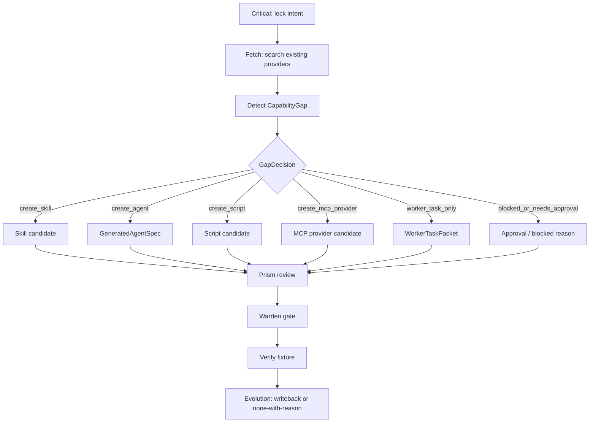

# Meta_Kim Capability Governance LangGraph Plan

## 文档控制

- 版本：v0.1
- 状态：Draft for local test
- Owner：meta-conductor 负责流程图，meta-warden 负责边界门禁，meta-prism 负责质量审查
- 目标：把 skill、治理 agent、执行 agent、script、MCP provider、workerTask 的分工说清楚，并说明它们如何形成 LangGraph 风格的执行图

## 一句话

Meta_Kim 不应该把所有东西都叫 agent。治理 agent 负责判断和门禁，skill 负责可复用方法，执行 agent 负责长期岗位，script 负责机械动作，MCP provider 负责外部系统能力，workerTask 负责本次任务。LangGraph 化时，这些不是同一种节点，而是不同职责的节点、路由条件和状态字段。

## 分工表

| 类型 | 人话解释 | 负责什么 | 不负责什么 | 典型产物 | LangGraph 角色 |
|---|---|---|---|---|---|
| 治理 agent | 公司里的管理层和质检层 | 判断目标、找证据、选路线、审质量、守边界 | 不做具体业务实现 worker | `GapDecision`、review、gate、writeback decision | 决策节点 / 审查节点 |
| 执行 agent | 一个长期岗位 | 长期负责某类专业问题，有边界、输入输出和验收 | 不绑定某次文件、ticket、今天任务 | `GeneratedAgentSpec`、`executionAgentCard` | 可复用 worker 节点 |
| skill | 可复用方法包 | 固化流程、知识、SOP、工具用法 | 不拥有长期责任身份 | `SKILL.md`、skill metadata | 工具/方法节点 |
| script / command | 机械化动作 | 稳定、可测试、本地可重复的转换或检查 | 不做判断，不做协作，不绕授权 | script spec、test entry | deterministic tool node |
| MCP provider | 外部能力入口 | 稳定连接外部系统，声明权限、凭证、审计边界 | 不代表一次性外部写动作已获授权 | provider spec、permission matrix | external tool/provider node |
| workerTask | 本次工作单 | 具体文件、范围、验收步骤、交付链接 | 不进入长期 identity | `workerTaskPacket` | run-scoped task node |
| validator / hook | 保险丝 | 拒绝危险路线、空路线、污染路线 | 不替 Thinking 规划路线 | deny reason、returnToStage | guard edge / fail-fast node |

## 谁负责什么

### 治理层

- `meta-warden`：入口、最终判断、能不能写回、能不能公开说完成。
- `meta-conductor`：把任务拆成流程、维护 LangGraph 节点和边、决定哪些节点串行或并行。
- `meta-scout`：找外部标杆、工具、provider、GitHub 参考，但不直接采纳。
- `meta-genesis`：设计长期 agent identity，回答“这个岗位是谁，长期边界是什么”。
- `meta-artisan`：设计 skill/tool/MCP/script loadout，回答“这个岗位靠什么能力工作”。
- `meta-sentinel`：审权限、外部动作、凭证、rollback。
- `meta-librarian`：审 memory 作用域、保留期、访问边界。
- `meta-prism`：审 agent 是否假抽象、假专业、工具堆砌、identity 污染。
- `meta-chrysalis`：记录重复缺口和用户纠正，重复 3 次以上才进入长期能力评审。

治理层的硬规则：它们可以设计、审查、门禁、记录，但不能变成通用执行 worker。

### 执行层

执行层只有在 Thinking 已经证明“需要长期 owner”时才创建或升级。比如 `test-coverage-specialist` 可以成为执行 agent，因为它长期负责测试覆盖率策略、缺口诊断和验证计划。

一次性任务不能升级成执行 agent。比如“这次改一个标题”就是 workerTask；“每次都要把 release notes 统一格式化”更像 skill 或 script；“需要连接 GitHub 发 PR”更像 MCP provider 或 blocked，需要授权。

## LangGraph 化怎么形成

LangGraph 的核心不是“把所有知识连成图”，而是“用 state、nodes、edges 把执行流程变成可运行的状态机”。官方模式是：定义 `StateGraph`，节点读取并更新 state，用普通 edge 串联，用 conditional edge 根据 state 决定下一步。

Meta_Kim 第一版不应该先做完整 CapabilityGraph。先做控制图：

```text
State = {
  intent,
  fetchEvidence,
  capabilityGap,
  gapDecision,
  generatedAgentSpec,
  workerTaskPacket,
  candidateWriteback,
  reviewScore,
  verificationEvidence,
  evolutionDecision
}
```

节点设计：

| LangGraph 节点 | Owner | 输入 | 输出 | 说明 |
|---|---|---|---|---|
| `critical_intent` | meta-warden / meta-conductor | 用户输入 | `intent` | 锁真实目标、成功标准、非目标 |
| `fetch_capabilities` | meta-scout / meta-artisan | `intent` | `fetchEvidence` | 查 agent、skill、script、MCP、provider、GitHub 标杆 |
| `detect_gap` | meta-conductor | `fetchEvidence` | `capabilityGap` | 判断有没有缺能力 |
| `decide_gap_route` | meta-conductor | `capabilityGap` | `gapDecision` | 六分类：skill/agent/script/MCP/workerTask/blocked |
| `design_skill_candidate` | meta-artisan | `gapDecision` | `candidateWriteback` | 只产候选，不自动写 canonical |
| `design_agent_spec` | meta-genesis + meta-artisan | `gapDecision` | `generatedAgentSpec` | 只在 create_agent 分支出现 |
| `design_script_candidate` | meta-artisan | `gapDecision` | `candidateWriteback` | 稳定机械动作 |
| `design_mcp_provider_candidate` | meta-artisan + meta-sentinel | `gapDecision` | `candidateWriteback` | 外部能力和权限边界 |
| `make_worker_task` | meta-conductor | `gapDecision` | `workerTaskPacket` | 本次任务单，不写长期身份 |
| `ask_approval_or_block` | meta-warden + meta-sentinel | `gapDecision` | approval request / blocked reason | 外部写动作或高风险 |
| `review_quality` | meta-prism | candidate / spec / task | `reviewScore` | 查假专业、假 owner、身份污染 |
| `warden_gate` | meta-warden | `reviewScore` | gate result | 决定能不能进入候选或执行 |
| `verify_fixture` | verify owner | gate result | `verificationEvidence` | 跑 fixture / diff / validator |
| `evolve_or_none` | meta-chrysalis | evidence | `evolutionDecision` | 写回候选或 none-with-reason |

条件边：

```text
START
-> critical_intent
-> fetch_capabilities
-> detect_gap
-> decide_gap_route

decide_gap_route -- create_skill --> design_skill_candidate
decide_gap_route -- create_agent --> design_agent_spec
decide_gap_route -- create_script --> design_script_candidate
decide_gap_route -- create_mcp_provider --> design_mcp_provider_candidate
decide_gap_route -- worker_task_only --> make_worker_task
decide_gap_route -- blocked_or_needs_approval --> ask_approval_or_block

candidate/spec/task
-> review_quality
-> warden_gate
-> verify_fixture
-> evolve_or_none
-> END
```

## Mermaid 图



## 外部优势怎么转译

| 标准类型 | 吸收什么 | 放在 Meta_Kim 哪一层 |
|---|---|---|
| 流程交接标准 | Think / Plan / Build / Review / Test / Ship / Reflect 的产品流程感 | `flowPosition`、handoff、上下游节点 |
| 记忆边界标准 | scoped memory、gap analysis、schema packs、evals | `memoryPolicy`、`gapPolicy`、`verificationPolicy` |
| 专业角色标准 | 专业岗位 spec、跨 runtime 投影、工具意识 | `GeneratedAgentSpec`、`installProjection`、agent quality scorecard |

## 最小落地顺序

1. 先做 `CapabilityGap -> GapDecision`。
2. 只在 `create_agent` 分支生成 `GeneratedAgentSpec`。
3. 用 `test-coverage-specialist` 验证能不能造出抽象但专业的 agent。
4. Prism 用 scorecard 审，Warden 决定是否进入 CandidateWriteback。
5. 通过 3 次以上重复缺口或用户纠正，再考虑写进长期能力。
6. 价值证明后，再把这些节点接成真正 LangGraph `StateGraph`。

## 失败条件

- 把 skill 写成 agent。
- 把治理 agent 当执行 worker。
- 把一次性 workerTask 写进长期 identity。
- 把 MCP provider 当成已授权外部写动作。
- 把 validator 当 planner。
- 先做完整 CapabilityGraph 或图数据库，而不是先验证 GapDecision。
- LangGraph 图里没有 conditional edge，导致所有缺口都走同一路线。

## Sources

- LangGraph `StateGraph`、node、edge、conditional edge 官方示例：https://github.com/langchain-ai/langgraph
